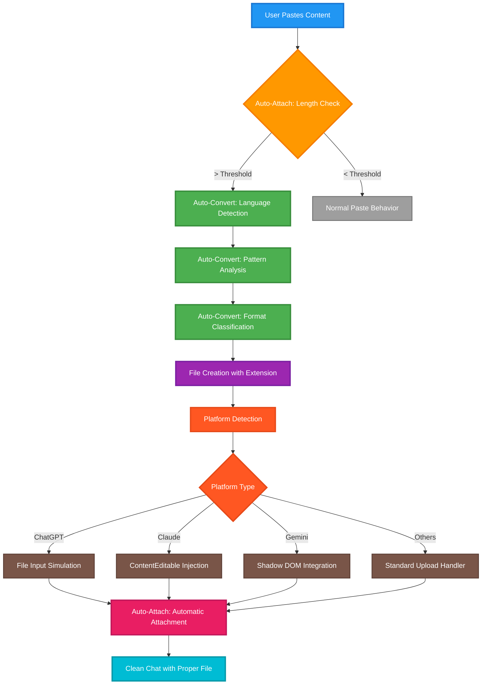

<div align="center">


# 🤝 Contributing to Multi-AI File Paster - Free Chrome Extension

**Free Chrome Extension Development Guidelines**

[](https://github.com/JosephMatino/MultiAiFilePaster)
[](#-development-workflow)
[](https://github.com/JosephMatino/MultiAiFilePaster/blob/main/LICENSE)

<table>
<tr>
<td><strong>Repository</strong></td>
<td><a href="https://github.com/JosephMatino/MultiAiFilePaster">Multi-AI File Paster</a></td>
</tr>
<tr>
<td><strong>CTO & Lead Developer</strong></td>
<td><a href="https://josephmatino.com">Joseph Matino</a></td>
</tr>
<tr>
<td><strong>CEO & Scrum Master</strong></td>
<td><a href="https://majokdeng.com">Majok Deng</a></td>
</tr>
<tr>
<td><strong>Company</strong></td>
<td><a href="https://hostwek.com/wekturbo">WekTurbo Designs - Hostwek LTD</a></td>
</tr>
</table>

---

Thank you for your interest in contributing to Multi-AI File Paster! This document provides complete guidelines and information for contributors to maintain our high-quality development standards.

</div>

---

## 🎯 Extension Core Functionality & Data Flow

Multi-AI File Paster automatically attaches and converts pasted text into file attachments for AI platforms. The extension has two core features: **Auto-Attach** automatically creates file attachments when pasted content exceeds your word threshold (default 500, adjustable 50-15,000), and **Auto-Convert** automatically detects the programming language or file type and assigns the correct extension. Instead of manually creating text files and uploading them, you paste normally and the extension handles everything automatically.

### 🔄 System Data Flow



### 🏗️ Architecture Overview

**Content Processing Pipeline:**
1. **Input Detection** - Monitor paste events across supported platforms
2. **Content Analysis** - Language detection and format classification  
3. **File Generation** - Create properly formatted files with correct extensions
4. **Platform Integration** - Inject files using platform-specific methods
5. **User Feedback** - Toast notifications and visual confirmation

The extension includes advanced features like batch processing for multiple code blocks and smart language detection for automatic file extension selection.

## 🤝 How to Contribute

<div align="center">

[](https://github.com/JosephMatino/MultiAiFilePaster/issues/new?template=bug_report.md)
[](https://github.com/JosephMatino/MultiAiFilePaster/issues/new?template=feature_request.md)

</div>

### Reporting Bugs

Before submitting a bug report:
1. **Check existing issues** to avoid duplicates
2. **Use the latest version** to ensure the bug hasn't been fixed
3. **Test on multiple platforms** if possible

When reporting bugs, include:
- Extension version number
- Browser version and OS
- AI platform where the issue occurred
- Steps to reproduce the problem
- Expected vs. actual behavior
- Console errors (if any)
- Screenshots or recordings (if helpful)

### Suggesting Features

We welcome feature suggestions! Before submitting:
1. Check if the feature already exists or is planned
2. Consider if it fits the extension's core purpose
3. Think about privacy implications

Feature requests should include:
- **Use case**: Why is this feature needed?
- **Behavior**: How should it work?
- **Alternatives**: What workarounds currently exist?
- **Impact**: How would this benefit users?

---

## 🛠️ Development Setup

<div align="center">

[](https://developer.chrome.com/docs/extensions/)
[](https://developer.chrome.com/docs/extensions/mv3/)
[](https://developer.mozilla.org/en-US/docs/Web/JavaScript)

</div>

### Prerequisites

- Chrome 88+ or Chromium-based browser
- Basic knowledge of JavaScript, HTML, CSS
- Familiarity with Chrome Extension Manifest V3
- Git for version control

### Getting Started

1. **Fork and clone the repository**
   ```bash
   # Fork the repository on GitHub first, then clone your fork
   git clone https://github.com/JosephMatino/MultiAiFilePaster.git
   cd MultiAiFilePaster
   ```

2. **Load the extension in Chrome**
   - Open Chrome and navigate to `chrome://extensions/`
   - Enable "Developer mode" (top-right toggle)
   - Click "Load unpacked" and select the project directory
   - The extension will appear in your extensions list

3. **Test the extension**
   - Navigate to a supported AI platform (ChatGPT, Claude, etc.)
   - Open the extension popup and verify settings load
   - Test paste functionality with long text

### Development Workflow

**🔧 Git Tool**: This project includes a `git.sh` helper for streamlined development. Use it instead of raw git commands.

#### **Quick Start with git.sh**
```bash
# Interactive mode (beautiful menu with colors)
./git.sh

# Programmatic mode (time-saving direct commands)
./git.sh 18                           # Check detailed status
./git.sh 5 1                          # Switch to develop branch
./git.sh 9 "feat: add new feature"    # Commit with message
./git.sh 11                           # Push to develop
```

#### **Standard Development Process**

1. **Create a feature branch**
   ```bash
   ./git.sh 5 1                        # Switch to develop
   ./git.sh 6 "feature/descriptive-name" # Rename branch
   ```

2. **Make your changes**
   - Follow our coding standards (see below)
   - Test thoroughly on all supported platforms
   - Update documentation if needed

3. **Test your changes**
   - Reload the extension in Chrome after changes
   - Test on multiple AI platforms
   - Verify no console errors
   - Check accessibility features

4. **Commit and push**
   ```bash
   ./git.sh 9 "feat: add descriptive feature description"
   ./git.sh 11                         # Push to develop
   ```

5. **Create a Pull Request**
   - Use a clear, descriptive title
   - Reference related issues
   - Include testing steps
   - Add screenshots if UI changes

#### **git.sh Features**
- 🎨 Styled output with team branding
- 🔄 21 git operations with clear LOCAL/REMOTE indicators
- ⚠️ Safety warnings for destructive operations
- 🚀 GitHub Actions integration and workflow status
- 📊 Repository status display with branch/commit info

## 📝 Coding Standards

### JavaScript Style Guide

- **ES6+ Features**: Use modern JavaScript features
- **Const/Let**: Prefer `const`, use `let` when reassignment needed
- **Arrow Functions**: Use for short functions and callbacks
- **Template Literals**: Use for string interpolation
- **Destructuring**: Use when it improves readability

```javascript
// ✅ Good
const handlePaste = async (text) => {
  const { wordCount, format } = analyzeText(text);
  return createFile({ content: text, format });
};

// ❌ Avoid
function handlePaste(text) {
  var result = analyzeText(text);
  var wordCount = result.wordCount;
  var format = result.format;
  return createFile({ content: text, format: format });
}
```

### Code Organization

- **Modular Structure**: Keep functions small and focused
- **Clear Naming**: Use descriptive variable and function names
- **Constants**: Define magic numbers and strings as constants
- **Version Management**: Never hardcode version numbers - use centralized config
- **Centralized Validation**: Use `window.GPTPF_VALIDATION` for all input validation
- **Error Handling**: Always handle potential errors gracefully

```javascript
// ✅ Good
const WORD_COUNT_THRESHOLD = 500;
const SUPPORTED_FORMATS = ['txt', 'js', 'py', 'md'];

const isLongEnoughToAttach = (text) => {
  return text.split(/\s+/).length >= WORD_COUNT_THRESHOLD;
};
```

### Documentation

- **File Headers**: Include team information and module purpose only
- **No Amateur Inline Comments**: Avoid configuration explanations and obvious comments
- **README Updates**: Update documentation for new features

```javascript
/**
 * Detects the programming language of the provided code
 * @param {string} code - The code content to analyze
 * @param {number} confidenceThreshold - Minimum confidence required (0-1)
 * @returns {Object} Detection result with language and confidence
 */
const detectLanguage = (code, confidenceThreshold = 0.35) => {
  // Implementation details...
};
```

### Security Guidelines

- **Input Sanitization**: Always sanitize user input
- **XSS Prevention**: Use safe DOM manipulation methods
- **Privacy First**: Never transmit user content
- **CSP Compliance**: Follow Content Security Policy rules

```javascript
// ✅ Good - Sanitized input
const sanitizeEventName = (name) => {
  return String(name).slice(0, 32).replace(/[^a-zA-Z0-9_]/g, '_');
};

// ❌ Avoid - Direct DOM insertion
element.innerHTML = userContent; // Potential XSS risk

// ✅ Good - Use centralized validation
const result = window.GPTPF_VALIDATION?.validateCustomExtension(userInput);
if (result?.valid) {
  // Use result.extension safely
}
```

### Centralized Validation System

**Always use the centralized validation system for user inputs:**

```javascript
// ✅ File extension validation
const result = window.GPTPF_VALIDATION?.validateCustomExtension('.js');
if (result?.valid) {
  console.log('Extension:', result.extension); // '.js'
}

// ✅ Filename sanitization
const sanitized = window.GPTPF_VALIDATION?.sanitizeFileName('my file.txt');
console.log(sanitized.sanitized); // 'my-file'

// ✅ Event name validation
const eventName = window.GPTPF_VALIDATION?.sanitizeEventName('user_action_123');
```

## 🏗️ Architecture Guide

### File Structure

**Key Areas for Contributors:**

```
Multi-AI File Paster/
├── src/                       # Main source code
│   ├── background/           # Service worker (Chrome extension background)
│   │   └── index.js         # Background script logic
│   ├── content/             # Content scripts (injected into AI platforms)
│   │   ├── components/      # Reusable UI components
│   │   │   ├── fileattach.js # File attachment functionality
│   │   │   ├── loader.js    # Loading animations
│   │   │   ├── modal.js     # Modal dialogs
│   │   │   └── toast.js     # Notifications
│   │   ├── platforms/       # Platform-specific handlers
│   │   │   ├── chatgpt.js   # ChatGPT integration
│   │   │   ├── claude.js    # Claude integration
│   │   │   ├── deepseek.js  # DeepSeek integration
│   │   │   ├── factory.js   # Platform factory pattern
│   │   │   ├── gemini.js    # Gemini integration
│   │   │   └── grok.js      # Grok integration
│   │   ├── index.js         # Main content script
│   │   └── styles.css       # Content styling
│   ├── popup/               # Extension popup interface (modular architecture)
│   │   ├── index.html       # Popup structure
│   │   ├── index.js         # Core popup logic and settings
│   │   ├── analytics.js     # Analytics dashboard and data visualization
│   │   ├── breakdowns.js    # Platform and format breakdown charts
│   │   ├── tooltips.js      # Tooltip system
│   │   ├── modals.js        # Modal dialog management
│   │   └── styles.css       # Popup styling
│   └── shared/              # Shared utilities
│       ├── config.js        # Centralized configuration system
│       ├── validation.js    # Centralized input validation and security
│       ├── metrics.js       # Privacy-safe analytics system
│       ├── languagedetector.js # Language detection engine
│       ├── batchprocessor.js # Multi-file batch processing engine
│       ├── debug.js         # Centralized debug logging system
│       ├── i18n.js          # Internationalization utilities
│       └── utils.js         # Chrome API operations utilities
├── _locales/                # Internationalization (11 languages)
│   ├── en/                  # English (baseline)
│   ├── ar/                  # Arabic
│   ├── de/                  # German
│   ├── es/                  # Spanish
│   ├── fr/                  # French
│   ├── hi/                  # Hindi
│   ├── ja/                  # Japanese
│   ├── pt/                  # Portuguese
│   ├── ru/                  # Russian
│   ├── sw/                  # Swahili
│   └── zh/                  # Chinese
├── logo/                    # Extension branding assets
├── manifest.json            # Chrome Extension Manifest V3
├── readme.md                # Project documentation
├── CONTRIBUTING.md          # Contribution guidelines (this file)
├── changelog.md             # Version history
├── LICENSE                  # Hostwek Custom License
└── NOTICE                   # Legal notices
```

### Key Concepts

1. **Platform Abstraction**: Each AI platform has a dedicated handler
2. **Component-Based UI**: Reusable components for toasts, modals, etc.
3. **Privacy-First**: All processing happens on-device
4. **Progressive Enhancement**: Works without configuration

### Adding New Platforms

1. Create a new platform handler in `src/content/platforms/`
2. Implement the required interface methods:
   - `attachFile(blob, filename)`: Core file attachment functionality
   - `getInputElement()`: Returns the appropriate input element for the platform
   - `showFeedback(message, type)`: Platform-specific user feedback
   - `cleanup()`: Cleanup resources when switching platforms
3. Add platform detection logic in `factory.js`
4. Update manifest.json with new host permissions:
   - Add to `host_permissions` array
   - Add to `content_scripts.matches` array
5. Add platform URL to `config.js` HOSTS array
6. Test thoroughly on the target platform

## 🧪 Testing Guidelines

### Automated Testing

The extension includes a comprehensive automated test suite in the `develop` branch:

**Test Suite**: 105 tests (38 unit + 67 integration)
**Framework**: Jest 29.7.0 with jsdom environment
**Coverage**: ~65% (meeting target)
**Execution**: ~1 second
**Pass Rate**: 100% (105/105 passing)
**Quality Rating**: 9.8/10 (Top 0.5% of Chrome extensions)

**Running Tests** (develop branch only):
```bash
cd tests
npm install
npm test                  # Run all tests
npm run test:coverage     # With coverage report
npm run test:watch        # Watch mode for development
```

All contributions should include appropriate test coverage for new features.

### Manual Testing Checklist

- [ ] Extension loads without errors
- [ ] Popup UI displays correctly
- [ ] Settings save and load properly
- [ ] Analytics dashboard loads and displays data
- [ ] Tooltips show and hide properly
- [ ] Modal dialogs open and close correctly
- [ ] Centralized validation prevents double dots
- [ ] Auto-attach works on all platforms
- [ ] Manual save functionality works
- [ ] Keyboard shortcuts function correctly
- [ ] Toast notifications appear and disappear
- [ ] Language detection works accurately
- [ ] Batch mode processes multiple blocks
- [ ] Privacy settings are respected

### Platform-Specific Testing

Test on each supported platform:
- **ChatGPT**: `chat.openai.com` and `chatgpt.com`
- **Claude**: `claude.ai` with override options
- **Gemini**: `gemini.google.com`
- **DeepSeek**: `chat.deepseek.com`
- **Grok**: `grok.com`

### Accessibility Testing

- [ ] Screen reader compatibility
- [ ] Keyboard navigation works
- [ ] ARIA labels are present
- [ ] Color contrast meets standards
- [ ] Focus indicators are visible

## 📋 Pull Request Guidelines

### PR Title Format

Use conventional commit format:
- `feat: add new feature`
- `fix: resolve bug issue`
- `docs: update documentation`
- `refactor: improve code structure`
- `test: add testing coverage`
- `style: formatting changes`

### PR Description Template

```markdown
## Summary
Brief description of changes

## Changes Made
- List of specific changes
- Include technical details
- Mention any breaking changes

## Testing
- [ ] Tested on ChatGPT
- [ ] Tested on Claude
- [ ] Tested on Gemini
- [ ] Tested on DeepSeek
- [ ] Tested on Grok
- [ ] No console errors
- [ ] Version numbers centralized (no hardcoded versions)
- [ ] Accessibility verified

## Screenshots
Include before/after screenshots for UI changes

## Related Issues
Closes #123
```

### Review Process

1. **Automated Checks**: Ensure no console errors
2. **Code Review**: At least one maintainer review required
3. **Testing**: Verify functionality on all platforms
4. **Documentation**: Check for necessary doc updates

## 🎯 Contribution Areas

### High Priority
- Bug fixes for existing functionality
- Performance improvements
- Accessibility enhancements
- Documentation improvements
- Test coverage expansion

### Medium Priority
- New platform support
- Additional file format detection (beyond current 30+ formats)
- UI/UX improvements
- Code refactoring
- Error handling improvements

### Low Priority
- Feature enhancements
- Developer tooling
- Build process improvements
- Integration improvements

## 📞 Getting Help

### Community Support
- **GitHub Issues**: Technical questions and bug reports
- **Discussions**: Feature ideas and general questions

### Direct Contact
- **Technical Issues**: [dev@josephmatino.com](mailto:dev@josephmatino.com) | [josephmatino.com](https://josephmatino.com) | [GitHub](https://github.com/JosephMatino)
- **Scrum Master**: [scrum@majokdeng.com](mailto:scrum@majokdeng.com) | [majokdeng.com](https://majokdeng.com) | [GitHub](https://github.com/Majok-Deng)
- **General Support**: [wekturbo@hostwek.com](mailto:wekturbo@hostwek.com)

## 📜 Community Standards

All contributors must follow our documented Community Standards outlined in [CODE_OF_CONDUCT.md](.github/CODE_OF_CONDUCT.md).

### Key Requirements

- **Technical Excellence**: Follow our development standards and testing procedures
- **User Privacy**: Respect our privacy-first architecture and security requirements
- **Clear Communication**: Use clear, technical language appropriate for software development
- **License Compliance**: Understand and respect our Hostwek Custom License terms

### Project-Specific Standards

- Test on all supported AI platforms (ChatGPT, Claude, Gemini, DeepSeek, Grok)
- Follow our git.sh workflow system for all development activities
- Maintain Chrome Extension Manifest V3 compliance
- Respect our architectural decisions and coding patterns

For complete community guidelines, enforcement procedures, and reporting channels, see [CODE_OF_CONDUCT.md](.github/CODE_OF_CONDUCT.md).

## 🏆 Recognition

Contributors who make major improvements will be:
- Listed in the project's contributors section
- Mentioned in release notes
- Invited to join the core team (for regular contributors)

## 📄 License

By contributing to Multi-AI File Paster, you grant Hostwek LTD a perpetual, worldwide license to use, modify, and incorporate your contributions into proprietary and licensed works under the Hostwek Custom License, without obligation of compensation. See `LICENSE` for details.

---

<div align="center">

## 🚀 Ready to Contribute?

[](https://github.com/JosephMatino/MultiAiFilePaster/fork)
[](https://github.com/JosephMatino/MultiAiFilePaster/discussions)

### 📞 Development Team

<table>
<tr>
<td align="center" width="50%">
<h4>Joseph Matino</h4>
<strong>CTO & Lead Developer</strong><br/>
<a href="https://josephmatino.com">🌐 Website</a> •
<a href="mailto:dev@josephmatino.com">📧 Email</a><br/>
<em>Technical architecture, code implementation, quality assurance</em>
</td>
<td align="center" width="50%">
<h4>Majok Deng</h4>
<strong>CEO & Scrum Master</strong><br/>
<a href="https://majokdeng.com">🌐 Website</a> •
<a href="mailto:scrum@majokdeng.com">📧 Email</a><br/>
<em>Project management, workflow optimization, team coordination</em>
</td>
</tr>
</table>

### **Powered By**

<div align="center">
<a href="https://hostwek.com" target="_blank">

</a>
<br/>
<strong>WekTurbo Designs - Hostwek LTD</strong><br/>
<a href="https://hostwek.com/wekturbo">🏢 Company Website</a>
</div>

---

**© 2025 · Multi‑AI File Paster · Developed by [Joseph Matino](https://josephmatino.com) | Scrum Master: [Majok Deng](https://majokdeng.com) | powered by <a href="https://hostwek.com" target="_blank" rel="noopener" aria-label="Hostwek website"></a>**

Thank you for helping make Multi-AI File Paster better for everyone! 🎉

</div>