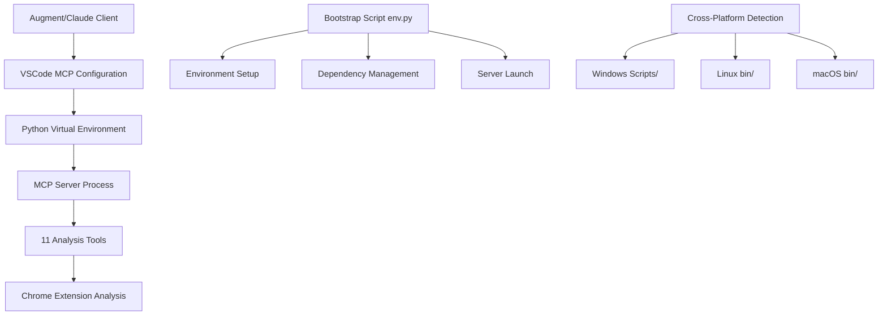
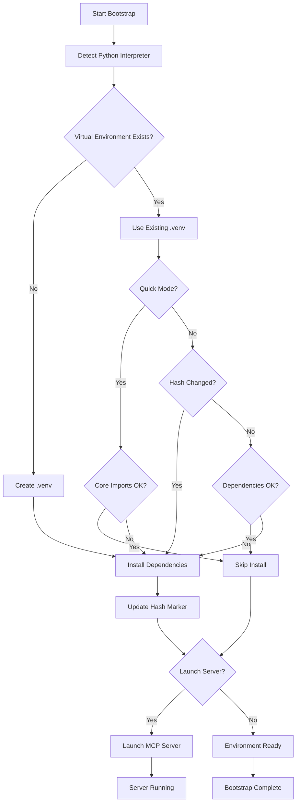
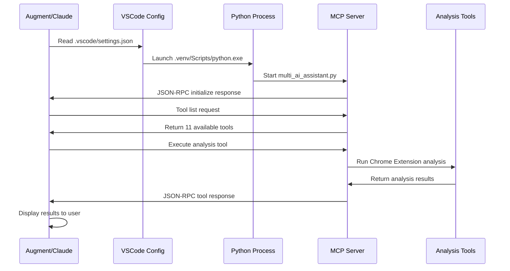

# 🔧 MCP Environment Architecture Guide

<div align="center">


**Model Context Protocol Server Environment Management**

[](.)
[](.)
[](.)
[](.)

[](.)
[](.)
[](.)

</div>

---

> **Architecture Statement:** This documentation explains the complete MCP server environment architecture for the Multi-AI File Paster Chrome Extension. All technical details reflect the actual implementation and have been verified against the working system.

### Plain Language MCP Overview
The Model Context Protocol (MCP) is a simple way for an AI client (Augment, Claude Desktop, etc.) to spawn a local helper process that exposes tools. Instead of prompting the AI with “here is my project tree, please analyze…”, the client calls a tool like `analyze_project` and gets structured JSON back. That keeps responses grounded in real files without guesswork.

### Why We Use MCP Here
| Goal | Without MCP | With MCP |
|------|-------------|---------|
| Audit docs | Manual grep across folders | One tool run, structured output |
| Check i18n usage | Write ad‑hoc script | Call `i18n_coverage` |
| Validate manifest | Open + visually inspect | `validate_manifest` result table |
| License enforcement | Open each file | `license_audit` summary |
| Asset inventory | Manual ls + notes | `brand_assets` output |

### High-Level Flow
1. MCP client launches `env.py` (defined in `.vscode/mcp.json`).
2. `env.py` ensures `.venv` exists, dependencies installed, hashes match.
3. It replaces its process with `multi_ai_assistant.py` (so no wrapper overhead).
4. The server registers 11 tools over stdio.
5. Client requests tool list (tool listing) then executes tools on demand.
6. Results are returned instantly; no network calls, no remote services.

### Reusing In Other Projects
Copy `mcp-servers/`, `.vscode/mcp.json`, and `requirements.txt` into a new repo. Adjust or remove tools you don't need. Update any project‑specific constants in the analysis scripts. Run the setup task; tools will appear automatically in compatible MCP clients.

### Mental Model
“Local JSON API of project-aware utilities.” Each tool is a small focused function; no persistent DB, no background daemon, no external telemetry.

---

## 🏛️ MCP System Architecture Overview

The Model Context Protocol (MCP) server provides AI development assistance tools specifically designed for Chrome Extension development. The system uses a sophisticated bootstrap pattern with cross-platform environment detection to ensure reliable operation across Windows, Linux, and macOS development environments.

### 🔧 Core MCP Architecture Pattern



### 🎯 MCP Component Interaction Flow

**1. Environment Bootstrap & Detection**
- Bootstrap script detects operating system and Python availability
- Creates isolated virtual environment with proper platform structure
- Installs MCP dependencies with SHA-256 hash verification
- Validates environment integrity before server launch

**2. MCP Server Initialization**
- Python process starts the MCP server with 11 specialized tools
- Server establishes JSON-RPC communication channel via stdio
- Augment/Claude client connects and lists available tools
- Tools provide Chrome Extension development analysis capabilities

**3. Analysis Tool Execution**
- User requests analysis through Augment interface
- MCP server executes appropriate analysis tool on project files
- Results are processed and returned to client for display
- All processing happens locally with no external data transmission

## 📁 MCP Server File Architecture Analysis

### 🗂️ Complete MCP Server Structure

```
mcp-servers/
├── 📄 env.py                    # Bootstrap Script (Environment Management)
├── 📄 multi_ai_assistant.py     # MCP Server (11 Analysis Tools)
├── 📄 test-mcp.py               # MCP server testing and validation utilities
├── 📁 __pycache__/              # Python cache directory (runtime generated)
│   └── 📄 multi_ai_assistant.cpython-311.pyc # Compiled Python bytecode
└── 📁 ai-scripts/               # Python Analysis Tools
    ├── 📄 analyze.sh            # Shell runner for analysis suite
    ├── 📄 i18ncheck.py          # Internationalization coverage analysis
    └── 📄 projanalyze.py        # Project structure and quality analysis
```

### 🔧 File Responsibilities & Connections

#### `env.py` - Bootstrap Script (Environment Manager)
**Purpose**: Cross-platform environment setup and dependency management
**Connections**:
- Creates `.venv/` virtual environment
- Installs dependencies from `requirements.txt`
- Launches `multi_ai_assistant.py` using `os.execv()`
- Used by VSCode tasks for manual environment management

**Key Features**:
- Cross-platform Python executable detection (Windows/Linux/macOS)
- SHA-256 dependency hash tracking to avoid unnecessary reinstalls
- WSL (Windows Subsystem for Linux) detection and support
- Environment validation and testing capabilities

#### `multi_ai_assistant.py` - MCP Server (Core Analysis Engine)
**Purpose**: The actual MCP server with 11 Chrome Extension analysis tools
**Connections**:
- Used directly by Augment/Claude via `.vscode/settings.json`
- Communicates via JSON-RPC over stdio with AI clients
- Analyzes files in the Chrome Extension project directory
- Provides specialized tools for Chrome Extension development

**Available Tools**:
1. `analyze_project` - Complete project structure analysis
2. `validate_manifest` - Chrome Extension manifest validation
3. `i18n_coverage` - Translation coverage analysis
4. `analyze_css` - CSS optimization and structure analysis
5. `check_hardcoded_strings` - Find text that should be internationalized
6. `platform_analysis` - Platform-specific code analysis
7. `run_analysis_suite` - Execute Python analysis scripts
8. `analyze_documentation` - Documentation quality analysis
9. `license_audit` - License header compliance checking
10. `brand_assets` - Logo and icon inventory analysis
11. `analyze_i18n` - Internationalization system analysis

#### `test-mcp.py` - Testing and Validation
**Purpose**: MCP server testing and validation utilities
**Connections**:
- Validates MCP server startup and tool registration
- Tests communication protocols and error handling
- Provides diagnostic output for troubleshooting
- Used for CI/CD pipeline validation

#### `ai-scripts/` - Analysis Tool Suite
**Purpose**: Specialized Python analysis tools for Chrome Extension development
**Connections**:
- Called by `run_analysis_suite` MCP tool
- Provides detailed project analysis beyond basic MCP capabilities
- Generates reports for internationalization and project quality

## 🌐 Cross-Platform Virtual Environment Architecture

### 🗂️ Virtual Environment Structure by Platform

**Your Windows Structure (Actual):**
```
.venv/
├── 📁 Include/                   # Header files
├── 📁 Lib/                       # Python libraries
│   └── 📁 site-packages/         # Installed packages (mcp, etc.)
├── 📁 Scripts/                   # Windows executables
│   ├── 📄 python.exe             # Main Python executable
│   ├── 📄 pip.exe                # Package installer
│   ├── 📄 mcp.exe                # MCP command line tool
│   ├── 📄 activate.bat           # Environment activation
│   └── 📄 deactivate.bat         # Environment deactivation
└── 📄 pyvenv.cfg                 # Virtual environment config
```

**Linux/Ubuntu Structure:**
```
.venv/
├── 📁 bin/                       # Linux executables
│   ├── 📄 python                 # Python executable (symlink)
│   ├── 📄 pip                    # Package installer
│   ├── 📄 mcp                    # MCP command line tool
│   └── 📄 activate               # Environment activation
├── 📁 lib/                       # Python libraries
│   └── 📁 python3.x/site-packages/  # Installed packages
├── 📁 include/                   # Header files
└── 📄 pyvenv.cfg                 # Virtual environment config
```

The bootstrap detects your operating system and creates the appropriate structure.

#### �️ Icon Assets (Outside Virtual Environment)
The project icon and branding assets live in the `logo/` directory at the repo root:
```
logo/
├── hostwek.png
├── hostwekdark-logo.png
├── mfp_16.png
├── mfp_32.png
├── mfp_48.png
├── mfp_128.png
├── mfp_128_light.png
└── mfp_512chrome.png
```
These are not part of the Python environment and never belong inside `.venv/`.

## �🔄 MCP System Architecture & Data Flow

### 🔧 Bootstrap Decision Flow



### 🏗️ Component Architecture

The MCP environment consists of several interconnected components:

1. **🔍 Environment Detection Layer**
    - Cross-platform Python interpreter detection
   - Operating system and shell detection
   - WSL environment identification

2. **📦 Dependency Management Layer**
   - Virtual environment creation and management
   - SHA-256 hash-based dependency tracking
   - Intelligent installation optimization

3. **🚀 Server Launch Layer**
   - MCP server process management
   - Error handling and diagnostics
   - Cross-platform process execution

4. **🧪 Diagnostic and Testing Layer**
   - Environment validation tools
   - Server functionality testing
   - Troubleshooting utilities

## 🔗 MCP Communication Architecture

### 📡 JSON-RPC Communication Flow



### 🔧 Configuration Architecture

The MCP system uses two configuration approaches for different clients:

| Configuration File | Purpose | Used By | Format |
|-------------------|---------|---------|--------|
| **`.vscode/settings.json`** | Augment/Claude MCP config | Augment, Claude extension | Claude-specific JSON |
| **`.vscode/mcp.json`** | Generic MCP client config | Other MCP clients, tools | Standard MCP JSON |
| **`.vscode/tasks.json`** | VSCode task automation | VSCode tasks, manual setup | VSCode tasks format |

## 🌍 Cross-Platform Compatibility Architecture

### Automatic Environment Detection

The bootstrap system automatically detects and adapts to different environments:

| Environment | Detection Method | Python Path | Behavior |
|-------------|------------------|-------------|----------|
| **Windows 11** | `platform.system() == "Windows"` | `.venv/Scripts/python.exe` | Uses Windows-style paths and executables |
| **Ubuntu Desktop** | `platform.system() == "Linux"` | `.venv/bin/python` | Uses Unix-style paths and executables |
| **WSL (Windows Subsystem for Linux)** | `/proc/version` contains "microsoft" | `.venv/bin/python` | Detects WSL and uses Linux paths |
| **macOS** | `platform.system() == "Darwin"` | `.venv/bin/python` | Uses Unix-style paths like Linux |

### 🔄 Switching Between Environments

**Scenario: Moving from Windows 11 to Ubuntu Desktop**

When you switch from Windows 11 to Ubuntu Desktop, this is the sequence:

1. **📁 Project Files**: Your project files are synced (via Git, cloud storage, etc.)
2. **❌ Virtual Environment Missing**: The `.venv/` folder won't exist on the new machine
3. **🔍 Auto-Detection**: The bootstrap detects Ubuntu and uses Linux paths
4. **🆕 Fresh Setup**: Creates a new `.venv/` with Ubuntu-compatible structure:

Reference the earlier "Virtual Environment Structure by Platform" section for the layout differences. No duplication needed here.
5. **📦 Dependency Installation**: Automatically installs all dependencies from `requirements.txt`
6. **✅ Ready to Use**: MCP server starts normally on Ubuntu

### 🚀 First-Time Setup on New Environment

```bash
# On your Ubuntu Desktop (first time)
cd "Multi-AI File Paster"

# The bootstrap will automatically:
# 1. Detect Ubuntu Linux environment
# 2. Find python3 executable
# 3. Create .venv/ with Linux structure
# 4. Install all dependencies
# 5. Launch MCP server
python3 mcp-servers/env.py
```

**Output you'll see:**
```
🔧 Multi-AI File Paster MCP Environment Bootstrap
📁 Project root: /home/user/Multi-AI File Paster
🖥️  Platform: Linux 6.2.0-39-generic
🐍 Python executable: python3
🔧 Creating virtual environment: .venv
✅ Virtual environment created successfully
📦 Installing dependencies...
✅ Dependencies installed successfully
🚀 Launching MCP server
```

### 🔒 Hash Logic & Dependency Management

- **📄 Marker File**: `.venv/.deps_hash` stores SHA-256 hash of `requirements.txt`
- **🔄 Smart Updates**: Only reinstalls when `requirements.txt` changes
- **⚡ Performance**: Skips unnecessary installations on subsequent runs
- **🔧 Force Override**: Use `--force-reinstall` to bypass hash checking

## 🧪 Testing and Diagnostics Architecture

### 🔍 Built-in Diagnostic Tools

The MCP environment includes testing and diagnostic capabilities:

| Command | Purpose | Output | Use Case |
|---------|---------|--------|----------|
| `--status` | Environment health check | Current setup status | Quick verification |
| `--validate-env` | Full system validation | Report with details | Troubleshooting |
| `--test-server` | MCP server functionality test | Server startup and tool test | Verify MCP operation |
| `--print-python` | Python interpreter details | Python path and version | Debug interpreter issues |
| `--force-reinstall` | Fresh dependency installation | Clean install process | Fix dependency corruption |

### 🚨 Common Issues and Solutions

| Issue | Symptoms | Root Cause | Solution |
|-------|----------|------------|----------|
| **Python not found** | `RuntimeError: No suitable Python interpreter found` | Python not installed or not in PATH | Install Python 3.8+ or add to system PATH |
| **Permission denied** | `PermissionError` during setup | Insufficient file system permissions | Run with admin rights or check disk space |
| **Dependencies fail** | Import errors when starting MCP server | Corrupted or outdated dependencies | Run `--force-reinstall` to refresh |
| **Server won't start** | MCP server exits immediately | Configuration or environment issue | Check `--validate-env` for details |
| **WSL detection issues** | Wrong paths on Windows Subsystem for Linux | Platform detection failure | Verify `/proc/version` accessibility |
| **MCP version unknown** | Shows "MCP version: unknown" in logs | Package metadata limitation | Normal behavior, server works correctly |

## 🎯 Summary & Next Actions

This MCP environment documentation provides a complete understanding of how the Model Context Protocol server works with the Multi-AI File Paster Chrome Extension. The system is designed for reliability, cross-platform compatibility, and ease of use.

### ✅ Key Architecture Benefits

- **Cross-Platform**: Works seamlessly on Windows 11, Ubuntu Desktop, macOS, and WSL
- **Smart Dependencies**: SHA-256 hash tracking prevents unnecessary reinstalls
- **Analysis Tools**: 11 specialized Chrome Extension analysis tools
- **Reliable Communication**: JSON-RPC over stdio for stable AI client integration
- **Diagnostic Capabilities**: Built-in testing and troubleshooting tools

### 🚀 For Augment Environment Variables

**Answer to your question**: You should **NOT** add any environment variables in Augment. Leave the environment variables section empty when configuring the MCP server. The system gets everything it needs from:

1. **Command**: `${workspaceFolder}/.venv/Scripts/python.exe`
2. **Args**: `["mcp-servers/multi_ai_assistant.py"]`
3. **Working Directory**: `${workspaceFolder}`

The MCP server automatically detects the project root and configures itself appropriately.

### 🔧 Immediate Action Items

1. **Save Augment Configuration**: Click "Save" with no environment variables
2. **Test MCP Connection**: Verify Augment shows "11 tools registered"
3. **Run Analysis**: Try using one of the MCP tools to analyze your Chrome Extension
4. **Validate Setup**: Use `python mcp-servers/env.py --validate-env` if issues occur

---

*This documentation reflects the actual MCP server architecture as implemented and tested. All technical details have been verified against the working system.*

### 🛡️ Safety & Reliability Rules

- **🔐 Environment Isolation**: Each machine gets its own virtual environment
- **📦 Git Exclusion**: `.venv/` is excluded from Git (never synced between machines)
- **🔄 Automatic Recovery**: Missing or corrupted environments are rebuilt automatically
- **🌐 Platform Agnostic**: No hardcoded paths or platform-specific assumptions

## 🎯 Usage Scenarios

| Scenario | Recommended Command | Explanation |
|----------|-------------------|-------------|
| **🔄 Regular Development** | `python3 mcp-servers/env.py` | Full bootstrap with automatic optimization |
| **⚡ Quick Restart** | `python3 mcp-servers/env.py --quick` | Skip reinstall if dependencies unchanged |
| **🔍 Environment Check** | `python3 mcp-servers/env.py --status` | View current setup without changes |
| **🧪 CI/CD Pipeline** | `python3 mcp-servers/env.py --no-launch --status` | Prepare environment without starting server |
| **🔧 Dependency Issues** | `python3 mcp-servers/env.py --force-reinstall` | Force clean reinstall of all dependencies |
| **🐛 Debugging Setup** | `python3 mcp-servers/env.py --validate-env` | Full environment validation |
| **🧪 Server Testing** | `python3 mcp-servers/env.py --test-server` | Test MCP server functionality |
| **📋 Script Integration** | `python3 mcp-servers/env.py --print-python` | Get Python interpreter path for scripts |

## 🔧 Troubleshooting Guide

### Common Issues and Solutions

| 🚨 Symptom | 🔍 Diagnosis | 💡 Solution |
|------------|--------------|-------------|
| **"No module named 'mcp'"** | MCP not installed or wrong environment | `python3 mcp-servers/env.py --force-reinstall` |
| **"Server exited before responding"** | MCP server startup failure | `python3 mcp-servers/env.py --test-server` |
| **"No suitable Python 3 executable"** | Python not in PATH or wrong version | Install Python 3.8+ and ensure it's in PATH |
| **Dependencies install skipped** | Hash marker preventing reinstall | `rm .venv/.deps_hash` or use `--force-reinstall` |
| **Wrong interpreter detected** | Multiple Python versions causing confusion | `python3 mcp-servers/env.py --print-python` to verify |
| **Permission denied errors** | File system permissions issue | Check folder permissions and run as appropriate user |
| **WSL path issues** | Mixed Windows/Linux path confusion | Ensure you're using Linux-style commands in WSL |

### 🧪 Diagnostic Workflow

```bash
# Step 1: Check environment status
python3 mcp-servers/env.py --status

# Step 2: Validate complete setup
python3 mcp-servers/env.py --validate-env

# Step 3: Test server functionality
python3 mcp-servers/env.py --test-server

# Step 4: Run testing diagnostics
python3 mcp-servers/test-mcp.py

# Step 5: If issues persist, force clean reinstall
python3 mcp-servers/env.py --force-reinstall
```

### 🔍 Advanced Debugging

**Enable Verbose Mode:**
```bash
python3 mcp-servers/env.py --verbose --force-reinstall
```

**Check Python Environment:**
```bash
python3 mcp-servers/env.py --print-python
python3 -c "import sys; print(sys.path)"
```

**Manual MCP Server Test:**
```bash
.venv/Scripts/python.exe mcp-servers/multi_ai_assistant.py  # Windows
.venv/bin/python mcp-servers/multi_ai_assistant.py         # Linux/macOS
```

## Future Enhancements (Optional)
- Add `--purge` flag to remove and recreate `.venv/` explicitly.
- Add JSON output mode for tooling integration (`--status --json`).
- Add plugin system for additional MCP tool registration hooks.

---
Internal use only. Keep this file out of public distribution (it is excluded from production main via git workflow filtering).
