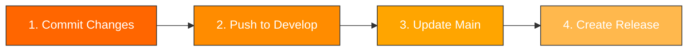

<div align="center">


# Git Workflow Documentation

<div style="margin: 20px 0;">


</div>

*Git automation with dual-branch workflow and integrated MCP validation*

</div>

---

## 🌿 Branch Strategy

The Multi-AI File Paster project uses a sophisticated dual-branch architecture designed for Chrome Web Store compliance and development efficiency. This strategy ensures that development tools and internal documentation remain available for the team while maintaining a clean, production-ready codebase for public distribution and Chrome Web Store submission.

### Dual-Branch Architecture
- **develop**: Complete development environment containing all project files, documentation, MCP servers, and development tools
- **main**: Production-optimized branch containing only files required for Chrome Web Store deployment

### Production File Filtering
The main branch automatically excludes development files defined in `git.sh` configuration:

```bash
DEVELOPMENT_FILES=(
  "docs/internal/"              # Internal documentation only
  "git.sh"                      # Development automation tool
  ".vscode/"                    # Editor configuration and MCP setup
  "mcp-servers/"                # Local MCP analysis tools
  ".venv/"                      # Python virtual environment
  "pyrightconfig.json"          # Type checking configuration
  "requirements.txt"            # Python dependencies for MCP only
  "__pycache__/"                # Python cache directories
  ".augment/"                   # AI development guidelines
  ".github/hooks/"              # Local git hook scripts
  ".github/instructions/"       # Internal AI and rules instructions
)
```

### Branch Safety Rules
1. **develop-first development**: All code changes begin on the develop branch
2. **automated main updates**: Main branch receives updates only through `git.sh` option 3
3. **hook validation**: Pre-commit hooks validate license headers and code quality
4. **MCP integration**: Built-in license audit and project analysis tools

---

## 📋 Daily Workflow

The git.sh automation tool enforces a structured four-step daily workflow that maintains code quality and deployment readiness throughout the development process. This standardized approach ensures consistent development practices while automating the complex process of maintaining separate development and production branches.

### Core Workflow (1→2→3→4)



#### Step 1: Commit Changes
```bash
./git.sh 1 "commit message"
```
- Adds all modified files to staging
- Creates commit with standardized message format
- Validates current branch safety (warns if on main)
- Integrates with pre-commit hooks for license validation

#### Step 2: Push to Develop
```bash
./git.sh 2
```
- Pushes current branch to develop remote
- Verifies remote origin configuration
- Confirms branch alignment (warns if not on develop)
- Uploads development environment with all tools

#### Step 3: Update Main from Develop
```bash
./git.sh 3
```
- Switches to main branch automatically
- Merges develop branch changes
- Removes development files per DEVELOPMENT_FILES configuration
- Creates production-ready deployment structure
- Updates production .gitignore

#### Step 4: Create Release Tag
```bash
# Interactive mode
./git.sh 4

# Direct mode with version
./git.sh 4 v1.2.0 "Bug fixes and improvements"
```
- Creates semantic version tags (v1.1.0 format)
- Generates user-facing release descriptions
- Pushes tags to trigger GitHub Actions
- Initiates Chrome Web Store deployment pipeline

---

## 🔧 Advanced Operations

### Repository Setup (First Time)

#### Fresh Start (Option 23)
```bash
./git.sh 23
```
- **WARNING**: Deletes ALL git history
- Cleans GitHub releases and tags
- Creates dual-branch structure
- Initializes with proper development/production separation
- Sets up develop as default working branch

#### Remote Configuration (Option 6)
```bash
./git.sh 6
```
- Configures GitHub repository connection
- Sets up: `https://github.com/JosephMatino/MultiAiFilePaster.git`
- Verifies team credentials and organization settings

### Branch Management

#### Switch Branches (Option 8)
```bash
./git.sh 8
```
- Interactive branch selection menu
- Shows current branch status
- Provides safety warnings for main branch work

#### Branch Setup
```bash
./git.sh 10  # Setup develop branch
./git.sh 11  # Setup main branch
```

### Status and Information (Option 5)
```bash
./git.sh 5
```
Displays full repository information:
- Current branch and commit count
- Modified files count
- Remote repository status
- Local vs remote branch count
- Team and organization details

---

## 🏷️ Release Management

### Tag Operations

#### List All Tags (Option 12)
```bash
./git.sh 12
```
- Shows all version tags with dates
- Displays associated commit messages
- Indicates which tags have been pushed to remote

#### Push Specific Tag (Option 13)
```bash
./git.sh 13
```
- Interactive tag selection
- Pushes individual tags to trigger releases
- Validates tag format and content

#### Delete Tags (Option 20)
```bash
./git.sh 20
```
- **DANGER ZONE**: Permanent deletion
- Removes both local and remote tags
- Requires explicit confirmation
- Cleans associated GitHub releases

### Commit History (Option 14)
```bash
./git.sh 14
```
- Structured commit log display
- Shows recent development activity
- Includes author, date, and message formatting

---

## ⚠️ Advanced and Danger Operations

### Force Operations (Use with Caution)

#### Force Push (Option 16)
```bash
./git.sh 16
```
- **WARNING**: Overwrites remote history
- Used for emergency corrections
- Requires explicit confirmation

#### Hard Reset (Option 18)
```bash
./git.sh 18
```
- **WARNING**: Loses uncommitted changes
- Resets working directory to last commit
- Non-recoverable operation

### Nuclear Options

#### Complete Reset (Option 24)
```bash
./git.sh 24
```
- **NUCLEAR**: Deletes EVERYTHING
- Requires typing exact confirmation phrase
- Only for catastrophic recovery scenarios

---

## 🔗 Integration Systems

### Git Hooks Integration (Option 25)
```bash
./git.sh 25
```
Installs project git hooks:
- **Pre-commit**: Validates Hostwek license headers on staged files
- **Post-commit**: Updates changelog and notification systems
- **MCP Integration**: Uses `license_audit` tool for compliance scanning

### MCP Server Integration
The git.sh tool integrates with MCP (Model Context Protocol) servers for:
- **License Auditing**: Automatic header compliance checking
- **Project Analysis**: Code quality and structure validation
- **Development Guidance**: AI-assisted workflow recommendations

### GitHub Actions Workflow
Tag creation (option 4) triggers automated:
- Chrome Web Store ZIP generation
- Release notes compilation
- CI/CD pipeline execution
- Security vulnerability scanning

---

## 📊 Team and Project Configuration

### Current Project Settings
```bash
PROJECT_NAME="Multi-AI File Paster"
PROJECT_VERSION="v1.1.0"
PROJECT_DESCRIPTION="Chrome Extension for auto-converting text to file attachments"
REPO_URL="https://github.com/JosephMatino/MultiAiFilePaster.git"
```

### Team Information
```bash
LEAD_DEVELOPER="Joseph Matino"
LEAD_DEVELOPER_EMAIL="dev@josephmatino.com"
LEAD_DEVELOPER_SITE="https://josephmatino.com"

SCRUM_MASTER="Majok Deng"
SCRUM_MASTER_EMAIL="scrum@majokdeng.com"
SCRUM_MASTER_SITE="https://majokdeng.com"

ORGANIZATION="WekTurbo Designs - Hostwek LTD"
ORGANIZATION_SITE="https://hostwek.com/wekturbo"
SUPPORT_EMAIL="wekturbo@hostwek.com"
```

---

## 🛡️ Safety and Recovery

### Pre-Operation Checks
The git.sh tool performs automatic safety validations:
- **Branch Safety**: Warns when working on main branch
- **Remote Verification**: Ensures GitHub connection before push operations
- **Staged Changes**: Confirms work is saved before destructive operations
- **License Compliance**: Validates Hostwek headers via MCP tools

### Recovery Procedures

#### For Lost Commits
```bash
git reflog  # Find lost commit hashes
git checkout <commit-hash>
git branch recovery-<date>
```

#### For Branch Issues
```bash
./git.sh 10  # Recreate develop branch
./git.sh 11  # Recreate main branch
```

#### For Complete Disasters
```bash
./git.sh 23  # Fresh start with history deletion
./git.sh 6   # Reconfigure remote origin
```

### Backup Recommendations
- **Daily**: Commit all work before ending session
- **Weekly**: Create development backups outside git
- **Before major changes**: Create feature branches
- **Before releases**: Verify Chrome Web Store package integrity

---

## 📈 Chrome Web Store Deployment

### Deployment Pipeline
1. **Development**: Work on develop branch with full environment
2. **Testing**: Validate features using MCP analysis tools
3. **Production Prep**: Run `./git.sh 3` to update main branch
4. **Release**: Execute `./git.sh 4 v1.x.x "description"` for store submission
5. **Verification**: Confirm ZIP package excludes development files

### Store-Ready Structure (Main Branch)
```
src/                    # Extension source code
manifest.json          # Chrome extension manifest
logo/                   # Extension icons and branding
_locales/              # Internationalization files
LICENSE                # Hostwek Custom License
readme.md              # User-facing documentation
NOTICE                 # Copyright and trademark notice
```

### Development Files (Develop Only)
```
docs/internal/         # Technical documentation
git.sh                 # Workflow automation
.vscode/               # VS Code and MCP configuration
mcp-servers/           # Local analysis tools
.github/hooks/         # Git validation scripts
.github/instructions/  # AI development rules
```

---

## 💡 Best Practices

### Daily Development
1. **Start with status**: `./git.sh 5` to check repository state
2. **Work on develop**: Never commit directly to main branch
3. **Frequent commits**: Save work regularly with descriptive messages
4. **Use the workflow**: Follow 1→2→3→4 sequence consistently
5. **MCP validation**: Let automated tools check license compliance

### Release Management
1. **Semantic versioning**: Use v1.2.3 format for all releases
2. **User-facing descriptions**: Write release notes for end users, not developers
3. **Test before release**: Validate extension functionality before tagging
4. **Chrome Web Store compliance**: Ensure main branch contains only required files

### Emergency Procedures
1. **Never panic**: git.sh provides recovery options for most scenarios
2. **Use thinking tools**: Leverage MCP for complex decisions
3. **Document issues**: Record problems and solutions for team learning
4. **Seek help**: Contact team members before using nuclear options

---

<div align="center">

**Git Workflow Mastery**  
*Development automation with dual-branch architecture*

**Last Updated**: September 18, 2025  
**Team**: Joseph Matino (Lead), Majok Deng (Scrum)  
**Organization**: WekTurbo Designs - Hostwek LTD

</div>
