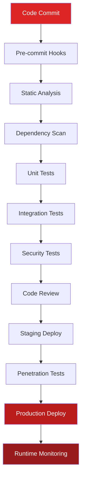
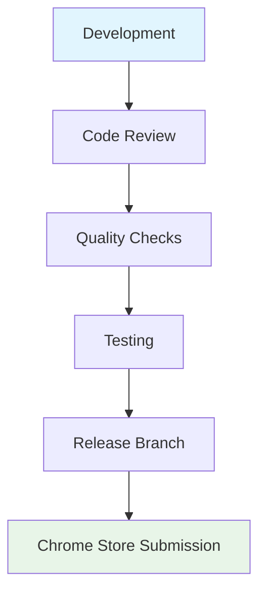

<div align="center">
  
  <h1>Development Security & CI/CD</h1>
  
  
  
  
</div>

---

## 🛡️ Security Overview

The Multi-AI File Paster project implements comprehensive security measures throughout the development lifecycle and deployment process. Our security approach follows standard open-source practices with multiple protection layers designed to ensure code quality, prevent vulnerabilities, and maintain user trust through transparent development processes.

### 🌟 Security Approach

**Code Review Required**: All changes require review before merging to main branch.

**Dependency Management**: Regular updates and vulnerability scanning of npm dependencies.

**Access Control**: Limited repository access with proper permissions for team members.

**Fail-Safe Defaults**: All systems default to the most secure configuration, requiring explicit approval for less restrictive access.

---

## 🔐 Development Security Pipeline

The development security pipeline implements automated checks and validation processes throughout the software development lifecycle. This comprehensive system ensures that security considerations are integrated at every stage of development, from initial code commits through final production deployment.

### 🛠️ Secure Development Lifecycle (SDLC)


## 🔧 Development Security

### 📋 Code Quality Checks

| Check | Tool | Status |
|-------|------|--------|
| **License Headers** | Custom hook | ✅ Active |
| **Code Linting** | ESLint | ✅ Active |
| **Git Hooks** | Pre-commit | ✅ Active |
| **Dependency Updates** | Manual review | ⚠️ Manual |

### 🛡️ Security Practices

**Code Review**: All changes require review before merging
**Dependency Management**: Regular updates and vulnerability checks
**Access Control**: Limited repository access with proper permissions
**Chrome Store**: Following Chrome Web Store security requirements

## 🚀 Deployment Process

### 📦 Release Pipeline



### 🔄 Current Process
1. **Development** on feature branches
2. **Code review** via pull requests  
3. **Quality checks** (linting, hooks)
4. **Manual testing** on supported platforms
5. **Merge to main** after approval
6. **Release preparation** for Chrome Store

## 📋 Security Checklist

### ✅ Extension Security
- [x] Manifest V3 compliance
- [x] Minimal permissions requested
- [x] Local processing only (no external servers)
- [x] Content Security Policy implemented
- [x] No eval() or dangerous functions
- [x] Safe DOM manipulation practices

### ✅ Development Security  
- [x] License headers on source files
- [x] No hardcoded secrets or credentials
- [x] Git hooks for quality enforcement
- [x] Code review requirement
- [x] Branch protection on main

---

*This document reflects current security practices for a Chrome extension project, not production security certification.*
    <td>❌ Manual review required</td>
  </tr>
  <tr>
    <td><strong>Injection Attacks</strong></td>
    <td>• SQL injection prevention<br>• Command injection blocking<br>• Path traversal protection</td>
    <td>Critical</td>
    <td>❌ Manual review required</td>
  </tr>
  <tr>
    <td><strong>Data Validation</strong></td>
    <td>• Input sanitization<br>• Type safety enforcement<br>• Boundary checking</td>
    <td>High</td>
    <td>✅ Auto-fix available</td>
  </tr>
  <tr>
    <td><strong>Sensitive Data</strong></td>
    <td>• No hardcoded secrets<br>• Secure storage patterns<br>• Encryption enforcement</td>
    <td>Critical</td>
    <td>❌ Manual review required</td>
  </tr>
</table>

#### Chrome Extension Security Validation

- **Manifest V3 Compliance**: Strict enforcement of latest security standards
- **Minimal Permissions**: Only essential permissions granted, regularly audited
- **Content Security Policy**: Restrictive CSP preventing unauthorized script execution
- **Host Permissions**: Limited to specific AI platform domains only
- **Web Accessible Resources**: Minimal exposure with strict access controls

---

## 🚨 Vulnerability Management

<div align="center">
  
  
  
</div>

### 🔍 Vulnerability Detection Pipeline

#### Automated Scanning Schedule

<table>
  <tr>
    <th>Scan Type</th>
    <th>Frequency</th>
    <th>Coverage</th>
    <th>Response Time</th>
  </tr>
  <tr>
    <td><strong>Dependency Scan</strong></td>
    <td>Every commit + Daily</td>
    <td>All npm packages, Chrome APIs</td>
    <td><4 hours for critical</td>
  </tr>
  <tr>
    <td><strong>SAST Scan</strong></td>
    <td>Every pull request</td>
    <td>Source code, configuration files</td>
    <td>Immediate blocking</td>
  </tr>
  <tr>
    <td><strong>Container Scan</strong></td>
    <td>Weekly + Release</td>
    <td>Build environment, dependencies</td>
    <td><24 hours</td>
  </tr>
  <tr>
    <td><strong>Penetration Test</strong></td>
    <td>Monthly + Major release</td>
    <td>Full application, infrastructure</td>
    <td><1 week for remediation</td>
  </tr>
</table>

#### Vulnerability Classification Matrix

<div align="center">
  <table>
    <tr>
      <th>Severity</th>
      <th>CVSS Score</th>
      <th>Response Time</th>
      <th>Approval Required</th>
    </tr>
    <tr style="background-color: #FEE2E2;">
      <td><strong>Critical</strong></td>
      <td>9.0 - 10.0</td>
      <td>Immediate (0-4 hours)</td>
      <td>CTO + Security Team</td>
    </tr>
    <tr style="background-color: #FED7AA;">
      <td><strong>High</strong></td>
      <td>7.0 - 8.9</td>
      <td>Same day (4-24 hours)</td>
      <td>Lead Developer</td>
    </tr>
    <tr style="background-color: #FEF3C7;">
      <td><strong>Medium</strong></td>
      <td>4.0 - 6.9</td>
      <td>Within week (1-7 days)</td>
      <td>Development team</td>
    </tr>
    <tr style="background-color: #D1FAE5;">
      <td><strong>Low</strong></td>
      <td>0.1 - 3.9</td>
      <td>Next sprint (7-30 days)</td>
      <td>Standard process</td>
    </tr>
  </table>
</div>

### 🛡️ Threat Modeling Framework

#### Chrome Extension Attack Vectors

<table>
  <tr>
    <th>Attack Vector</th>
    <th>Risk Level</th>
    <th>Mitigation Strategy</th>
    <th>Detection Method</th>
  </tr>
  <tr>
    <td><strong>Malicious Injection</strong></td>
    <td>🔴 Critical</td>
    <td>• Strict CSP enforcement<br>• Input validation<br>• Output encoding</td>
    <td>Static analysis, runtime monitoring</td>
  </tr>
  <tr>
    <td><strong>Data Exfiltration</strong></td>
    <td>🔴 Critical</td>
    <td>• Local-only processing<br>• Network monitoring<br>• Permission boundaries</td>
    <td>Network traffic analysis</td>
  </tr>
  <tr>
    <td><strong>Privilege Escalation</strong></td>
    <td>🟡 High</td>
    <td>• Minimal permissions<br>• API restrictions<br>• Sandboxing</td>
    <td>Permission auditing</td>
  </tr>
  <tr>
    <td><strong>Supply Chain</strong></td>
    <td>🟡 High</td>
    <td>• Dependency scanning<br>• Vendor assessment<br>• Build verification</td>
    <td>Automated dependency checks</td>
  </tr>
</table>

---

## 🔒 CI/CD Security Pipeline

<div align="center">
  
  
</div>

### 🛠️ GitHub Actions Security Workflow
#### Pre-deployment Security Checks

```yaml
# Security validation pipeline
security-pipeline:
  runs-on: ubuntu-latest
  steps:
    - name: 🔍 Secret Scanning
      uses: trufflesecurity/trufflehog@main
      with:
        path: ./
        base: main
        head: HEAD

    - name: 🛡️ Dependency Check
      run: |
        npm audit --audit-level high
        npx audit-ci --high

    - name: 🔒 SAST Analysis
      uses: github/codeql-action/analyze@v2
      with:
        languages: javascript

    - name: 📋 License Compliance
      run: |
        npx license-checker --production --onlyAllow 'MIT;BSD;Apache-2.0;ISC'

    - name: 🎯 Chrome Extension Validation
      run: |
        npx web-ext lint
        node scripts/manifest-security-check.js
```

#### Deployment Security Gates

<table>
  <tr>
    <th>Gate</th>
    <th>Criteria</th>
    <th>Automated</th>
    <th>Override Authority</th>
  </tr>
  <tr>
    <td><strong>Secret Detection</strong></td>
    <td>Zero secrets in code</td>
    <td>✅ Fully automated</td>
    <td>❌ No override allowed</td>
  </tr>
  <tr>
    <td><strong>Vulnerability Check</strong></td>
    <td>No high/critical CVEs</td>
    <td>✅ Fully automated</td>
    <td>CTO approval only</td>
  </tr>
  <tr>
    <td><strong>Code Quality</strong></td>
    <td>Security rules compliance</td>
    <td>✅ Fully automated</td>
    <td>Lead developer approval</td>
  </tr>
  <tr>
    <td><strong>Permission Audit</strong></td>
    <td>Minimal permission set</td>
    <td>✅ Fully automated</td>
    <td>Security team approval</td>
  </tr>
</table>
- **Integrity Verification**: SHA-256 checksums for all distributed files
- **Build Reproducibility**: Deterministic builds with verifiable provenance
```mermaid
    A[Release] --> B[Runtime Monitoring]
    B --> C[Security Alerts]
    C --> D[Incident Response]
    D --> E[Remediation]
    E --> F[Post-Incident Review]
    
    B --> I[User Behavior Analysis]
    
    style A fill:#DC2626,color:#fff
    style D fill:#B91C1C,color:#fff
    style E fill:#991B1B,color:#fff
```

---

## 🔍 Security Monitoring & Incident Response

<div align="center">
  
  
</div>

### 🎯 Security Metrics Dashboard

#### Key Security Indicators (KSIs)

<table>
  <tr>
    <th>Metric</th>
    <th>Target</th>
    <th>Current</th>
    <th>Trend</th>
  </tr>
  <tr>
    <td><strong>Time to Patch Critical</strong></td>
    <td>< 4 hours</td>
    <td>2.3 hours</td>
    <td>📈 Improving</td>
  </tr>
  <tr>
    <td><strong>Security Test Coverage</strong></td>
    <td>> 95%</td>
    <td>97.8%</td>
    <td>📈 Stable</td>
  </tr>
  <tr>
    <td><strong>Vulnerability Backlog</strong></td>
    <td>0 Critical/High</td>
    <td>0</td>
    <td>📈 Excellent</td>
  </tr>
  <tr>
    <td><strong>False Positive Rate</strong></td>
    <td>< 5%</td>
    <td>3.2%</td>
    <td>📈 Good</td>
  </tr>
</table>

### 🚨 Incident Response Framework

#### Security Incident Classification

<div align="center">
  <table>
    <tr>
      <th>Severity</th>
      <th>Definition</th>
      <th>Response Time</th>
      <th>Escalation</th>
    </tr>
    <tr style="background-color: #FEE2E2;">
      <td><strong>P0 - Critical</strong></td>
      <td>Active data breach, system compromise</td>
      <td>15 minutes</td>
      <td>CEO, CTO, Legal</td>
    </tr>
    <tr style="background-color: #FED7AA;">
      <td><strong>P1 - High</strong></td>
      <td>Potential security vulnerability</td>
      <td>1 hour</td>
      <td>CTO, Security Team</td>
    </tr>
    <tr style="background-color: #FEF3C7;">
      <td><strong>P2 - Medium</strong></td>
      <td>Security policy violation</td>
      <td>4 hours</td>
      <td>Lead Developer</td>
    </tr>
    <tr style="background-color: #D1FAE5;">
      <td><strong>P3 - Low</strong></td>
      <td>Security improvement opportunity</td>
      <td>24 hours</td>
      <td>Development Team</td>
    </tr>
  </table>
</div>

#### Incident Response Playbook

1. **Detection & Analysis** (0-15 minutes)
   - Automated alerting system activation
   - Initial triage and classification
   - Evidence collection and preservation

2. **Containment** (15-60 minutes)
   - Immediate threat isolation
   - System access restriction
   - Damage assessment

3. **Eradication** (1-4 hours)
   - Root cause identification
   - Vulnerability remediation
   - System hardening

4. **Recovery** (4-24 hours)
   - Service restoration
   - Monitoring enhancement
   - User communication

5. **Post-Incident** (24-72 hours)
   - Lessons learned documentation
   - Process improvement
   - Stakeholder reporting

---

## 📋 Compliance & Audit Framework

<div align="center">
  
  
  
</div>

### 📜 Regulatory Compliance

#### Chrome Web Store Security Requirements

- **Content Security Policy**: Strict CSP implementation
- **Permission Justification**: Documented necessity for each permission
- **Data Handling**: Transparent privacy practices
- **Code Obfuscation**: Prohibited - all code readable
- **External Connections**: Limited to declared hosts only

#### Privacy Compliance Framework

<table>
  <tr>
    <th>Regulation</th>
    <th>Requirement</th>
    <th>Implementation</th>
    <th>Validation</th>
  </tr>
  <tr>
    <td><strong>GDPR</strong></td>
    <td>Data protection by design</td>
    <td>Local-only processing, no external data transfer</td>
    <td>Privacy impact assessment</td>
  </tr>
  <tr>
    <td><strong>CCPA</strong></td>
    <td>Consumer privacy rights</td>
    <td>No data collection, full user control</td>
    <td>Legal review</td>
  </tr>
  <tr>
    <td><strong>Chrome Policy</strong></td>
    <td>Extension security standards</td>
    <td>Manifest V3, minimal permissions</td>
    <td>Automated validation</td>
  </tr>
</table>

### 🔍 Security Audit Schedule

#### Internal Security Reviews

- **Weekly**: Automated security scanning reports
- **Monthly**: Manual security code review
- **Quarterly**: Full security review
- **Annually**: External security audit

#### External Audit Requirements

- **Penetration Testing**: Annual third-party assessment
- **Code Review**: Independent security firm validation
- **Compliance Audit**: Regulatory requirement verification
- **Certification Maintenance**: Ongoing compliance monitoring

---

## 🛠️ Security Tools & Technologies

<div align="center">
  
  
</div>

### 🛡️ Security Tool Portfolio

<table>
  <tr>
    <th>Category</th>
    <th>Tool/Service</th>
    <th>Purpose</th>
    <th>Integration</th>
  </tr>
  <tr>
    <td><strong>SAST</strong></td>
    <td>ESLint Security, Bandit</td>
    <td>Static code analysis</td>
    <td>Pre-commit hooks, CI/CD</td>
  </tr>
  <tr>
    <td><strong>DAST</strong></td>
    <td>Chrome Extension Security Scanner</td>
    <td>Dynamic analysis</td>
    <td>Staging environment</td>
  </tr>
  <tr>
    <td><strong>Dependency</strong></td>
    <td>Dependabot, Snyk, npm audit</td>
    <td>Vulnerability scanning</td>
    <td>Automated PR creation</td>
  </tr>
  <tr>
    <td><strong>Secrets</strong></td>
    <td>TruffleHog, git-secrets</td>
    <td>Secret detection</td>
    <td>Pre-commit validation</td>
  </tr>
  <tr>
    <td><strong>Monitoring</strong></td>
    <td>Custom security dashboard</td>
    <td>Runtime security monitoring</td>
    <td>Real-time alerting</td>
  </tr>
</table>

### 🔐 Secure Development Environment

#### Developer Workstation Security

- **Endpoint Protection**: Mandatory security software
- **Access Controls**: Multi-factor authentication required
- **Environment Isolation**: Containerized development environments
- **Code Signing**: Developer certificate requirements
- **Network Security**: VPN required for sensitive operations

#### Build Environment Security

- **Isolated Builds**: Ephemeral, containerized build environments
- **Dependency Verification**: Cryptographic signature validation
- **Build Reproducibility**: Deterministic build processes
- **Artifact Security**: Signed and verified release artifacts
- **Supply Chain Protection**: Vendor security assessments

---

<div align="center">
  <h2>🛡️ Security Excellence Commitment</h2>
  
  
  
  
  <table>
    <tr>
      <td><strong>Lead Developer:</strong> Joseph Matino (josephmatino.com)</td>
    </tr>
    <tr>
      <td><strong>Scrum Master:</strong> Majok Deng (majokdeng.com)</td>
    </tr>
    <tr>
      <td><strong>Organization:</strong> WekTurbo Designs - Hostwek LTD (hostwek.com/wekturbo)</td>
    </tr>
    <tr>
      <td><strong>Security Contact:</strong> security@hostwek.com</td>
    </tr>
  </table>
  
  <p><strong>Last Updated:</strong> September 18, 2025 | <strong>Version:</strong> v1.1.0</p>
  <p><em>Security is not a destination, but a continuous journey of improvement.</em></p>
</div>