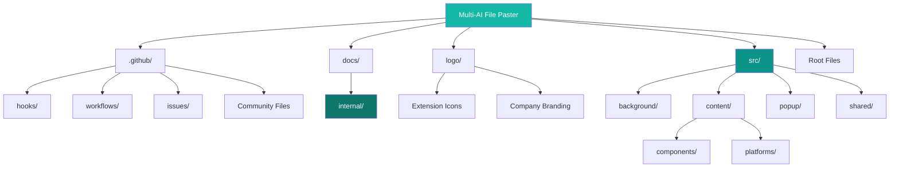

<div align="center">
  
  <h1>Documentation Standards & Architecture</h1>
  
  
  
  
  
  
  
</div>

---

## 🏗️ Project Architecture & Documentation Framework

<div align="center">
  
  
  
</div>

### 🌟 Documentation Philosophy

Our documentation system uses a structured approach with broad coverage, automated checks, and ongoing maintenance. Every file serves a clear purpose in the development lifecycle, from internal technical specifications to user guides.

### 📊 Documentation Metrics

<table align="center">
  <tr>
    <th>Category</th>
    <th>Files</th>
    <th>Purpose</th>
    <th>Audience</th>
  </tr>
  <tr>
    <td><strong>Internal Docs</strong></td>
    <td>6 files</td>
    <td>Technical architecture & development</td>
    <td>Development team</td>
  </tr>
  <tr>
    <td><strong>Public Docs</strong></td>
    <td>4 files</td>
    <td>User guides & contribution</td>
    <td>End users & contributors</td>
  </tr>
  <tr>
    <td><strong>GitHub Config</strong></td>
    <td>15+ files</td>
    <td>Repository automation & community</td>
    <td>Contributors & maintainers</td>
  </tr>
  <tr>
    <td><strong>Source Files</strong></td>
    <td>25+ files</td>
    <td>Extension functionality</td>
    <td>Development team</td>
  </tr>
</table>

---

## 📁 Complete Project Structure Analysis

### 🔍 Development Branch Structure (Full)



<div align="center">
  <table>
    <tr>
      <td align="center"></td>
      <td align="center"></td>
      <td align="center"></td>
    </tr>
  </table>
</div>

### 🗂️ Detailed Directory Structure

The Multi-AI File Paster project maintains a comprehensive directory structure designed for efficient development workflows, automated quality control, and clear separation between internal and public-facing resources. Each directory serves specific purposes in the overall development and deployment pipeline, ensuring maintainable code organization and professional project management standards.

<div align="center">
  
</div>

#### GitHub Configuration & Automation (.github/)
<details>
<summary><strong>📋 Click to expand complete .github/ structure</strong></summary>

```
.github/
├── CODEOWNERS                  # Code ownership & review assignments
├── CODE_OF_CONDUCT.md          # Community behavior standards
├── FUNDING.yml                 # GitHub Sponsors configuration
├── PULL_REQUEST_TEMPLATE.md    # PR template for contributors
├── SECURITY.md                 # Security policy & vulnerability reporting
├── SUPPORT.md                  # Support resources & help channels
├── dependabot.yml              # Automated dependency updates
├── discussions/                # Discussion templates
│   └── general.yml             # General discussion template
├── hooks/                      # Development git hooks
│   ├── pre-commit              # Code validation before commit
│   └── post-commit             # Post-commit feedback
├── issues/                     # Issue templates
│   ├── bug_report.md           # Standardized bug reporting
│   ├── config.yml              # Issue template configuration
│   └── feature_request.md      # Feature request template
├── labeler.yml                 # Automatic PR labeling rules
└── workflows/                  # GitHub Actions automation
    ├── ci.yml                  # Continuous integration pipeline
    └── release.yml             # Automated release workflow
```
</details>

#### Documentation System (docs/)
<details>
<summary><strong>📚 Click to expand documentation structure</strong></summary>

```
docs/
└── internal/                   # Internal development documentation
    ├── TECHNICAL_DOCS.md       # ⚙️ Technical architecture & implementation
    ├── features.md             # 🎯 Feature matrix & implementation status
    ├── GIT_WORKFLOW.md         # 🔄 Git workflow & branch management
    ├── description.md          # 🎨 Product description & Chrome Store content
    ├── docs.md                 # 📖 Documentation standards (this file)
    └── PIPELINE_PROTECTION.md  # 🛡️ Security & deployment protection
```
</details>

#### Extension Source Code (src/)
<details>
<summary><strong>💻 Click to expand complete source structure</strong></summary>

```
src/
├── background/                 # Service Worker (Manifest V3)
│   └── index.js                # Background script & cross-platform messaging
├── content/                    # Content Scripts (Injected into AI platforms)
│   ├── components/             # Reusable UI Components
│   │   ├── fileattach.js       # File attachment with drag-drop support
│   │   ├── loader.js           # SVG loading indicators (CLS-optimized)
│   │   ├── modal.js            # Accessible modal dialogs
│   │   └── toast.js            # Toast notifications (bottom-right)
│   ├── platforms/              # Platform-specific implementations
│   │   ├── factory.js          # Platform detection & instantiation
│   │   ├── chatgpt.js          # ChatGPT integration (chat.openai.com)
│   │   ├── claude.js           # Claude integration (claude.ai)
│   │   ├── gemini.js           # Gemini integration (gemini.google.com)
│   │   ├── grok.js             # Grok integration (x.com/i/grok)
│   │   └── deepseek.js         # DeepSeek integration (chat.deepseek.com)
│   ├── index.js                # Content script entry point
│   └── styles.css              # Content script styling
├── popup/                      # Extension Popup Interface
│   ├── index.html              # Semantic HTML5 structure
│   ├── index.js                # Popup controller & analytics
│   ├── styles.css              # Tailwind-inspired styling
│   ├── analytics.js            # SVG analytics dashboard
│   ├── breakdowns.js           # Usage breakdowns & statistics
│   ├── modals.js               # Modal dialog management
│   └── tooltips.js             # Premium tooltip system
└── shared/                     # Cross-context utilities
    ├── batchprocessor.js       # Content splitting processor for large files
    ├── compression.js          # File compression algorithms
    ├── config.js               # Centralized configuration
    ├── debug.js                # Centralized debug logging and error handling
    ├── i18n.js                 # Chrome i18n API integration
    ├── languagedetector.js     # Programming language detection
    ├── metrics.js              # Performance monitoring
    ├── utils.js                # Unified Chrome API operations utilities
    └── validation.js           # Security-focused validation
```
</details>

#### Branding & Assets (logo/)
<details>
<summary><strong>🎨 Click to expand branding assets</strong></summary>

```
logo/
├── hostwek.png                 # Company logo (300 PPI)
├── hostwekdark-logo.png        # Dark theme company logo
├── mfp_128.png                 # Main extension icon 128x128
├── mfp_128_light.png           # Light theme variant 128x128
├── mfp_16.png                  # Small icon 16x16
├── mfp_32.png                  # Medium icon 32x32
├── mfp_48.png                  # Standard icon 48x48
└── mfp_512chrome.png           # Chrome Web Store icon 512x512
```
</details>

#### Root Configuration Files
<details>
<summary><strong>⚙️ Click to expand root configuration</strong></summary>

```
Root Level/
├── .gitignore                  # Git ignore rules & exclusions
├── .vscode/                    # VS Code workspace settings
├── CONTRIBUTING.md             # PUBLIC contribution guidelines
├── LICENSE                     # Hostwek Custom License
├── changelog.md                # PUBLIC version history
├── git.sh                      # Git workflow automation tool
├── manifest.json               # Chrome Extension Manifest V3
└── readme.md                   # PUBLIC user documentation
```
</details>

### 🚀 Production Distribution Structure (Main Branch)

<div align="center">
  
  
</div>

**Production Exclusions:** `docs/internal/`, `git.sh`, `.github/hooks/`

| Category | Development | Production | Rationale |
|----------|-------------|------------|-----------|
| **Documentation** | Full internal docs | Public docs only | Internal specs remain private |
| **Git Tools** | Automation scripts | Standard Git only | Development tools excluded |
| **Hooks** | Pre/post-commit | None | Development-specific validation |
| **Source Code** | Complete | Complete | Full functionality preserved |
| **Configuration** | All files | Essential only | Clean production package |

---

## 📋 File Header Standards & Signature Requirements

<div align="center">
  
  
</div>

### 📝 Header Signature Policy

**Header signatures are ONLY required for:**
- `.js` files in `src/`
- `.css` files in `src/`  
- `.html` files in `src/`
- `.py` files in `mcp-servers/`
- Git hook files in `.github/hooks/`

**Documentation files (.md) should NOT include header signatures** - they start with extension logo and content directly.

### 🎯 Header Content Requirements

Every header signature must include:
- **File Path**: Complete relative path from project root
- **Function Description**: Clear explanation of file purpose
- **Architecture Role**: How file fits in overall system
- **Team Information**: Developer credits and contact details
- **Version Information**: Current version and update dates
- **Repository Details**: GitHub link and branch context

### 📖 Header Template Structure

The standardized header template provides comprehensive metadata about each source code file, including technical specifications, development team information, and project context. This template ensures consistency across all source files while providing essential information for development team coordination and project maintenance activities.

```javascript
/*
 * ================================================================================
 * MULTI-AI FILE PASTER CHROME EXTENSION | PRODUCTION RELEASE v1.1.0
 * CHROME EXTENSION SOFTWARE - HOSTWEK CUSTOM LICENSE
 * ================================================================================
 *
 * MODULE: src/popup/breakdowns.js
 * FUNCTION: Platform and format breakdown visualization components
 * ARCHITECTURE: Chrome Extension Manifest V3, modular event-driven design
 * SECURITY: Client-side processing, zero data transmission, privacy-first
 * PERFORMANCE: Optimized for Chrome V3 Manifest, lazy loading, efficient DOM
 * COMPATIBILITY: Chrome 88+, Edge 88+, Opera 74+, modern browser APIs
 *
 * DEVELOPMENT TEAM & PROJECT LEADERSHIP:
 * • LEAD DEVELOPER: Joseph Matino <dev@josephmatino.com> | https://josephmatino.com
 * • SCRUM MASTER & PROJECT FUNDING: Majok Deng <scrum@majokdeng.com> | https://majokdeng.com
 * • QUALITY ASSURANCE: Automated testing pipeline with CircleCI integration
 * • PROJECT MANAGEMENT: Agile methodology, continuous integration/deployment
 * • CODE REVIEW: Peer review process, automated quality gates, security audits
 * • DOCUMENTATION: Technical writers, API documentation, user experience guides
 *
 * ORGANIZATION & GOVERNANCE:
 * • COMPANY: HOSTWEK LTD - Premium Hosting Company | East Africa | https://hostwek.com
 * • DIVISION: WekTurbo Designs - Web Development Division | https://hostwek.com/wekturbo
 * • REPOSITORY: https://github.com/JosephMatino/MultiAiFilePaster
 * • TECHNICAL SUPPORT: dev@josephmatino.com, wekturbo@hostwek.com | Response time: 24-48 hours
 * • DOCUMENTATION: Complete API docs, user guides, developer documentation
 * • COMMUNITY: Development community, issue tracking, feature requests
 * • ROADMAP: Public development roadmap, community feedback integration
 *
 * TECHNICAL ARCHITECTURE & INTEGRATIONS:
 * • PLATFORM INTEGRATIONS: ChatGPT, Claude, Gemini, DeepSeek, Grok
 * • CORE DEPENDENCIES: Chrome Extension APIs, CompressionStream, FileReader API
 * • FEATURES: Batch processing, file compression, analytics, multi-platform support
 * • TESTING: Automated unit tests, integration tests, cross-browser validation
 * • MONITORING: Performance metrics, error tracking, user analytics (opt-in)
 * • SCALABILITY: Modular design, plugin architecture, extensible configuration
 *
 * BUILD & DEPLOYMENT PIPELINE:
 * • BUILD SYSTEM: Node.js build pipeline, ESLint validation, automated testing
 * • DEPLOYMENT: Chrome Web Store distribution, automated release pipeline
 * • VERSION CONTROL: Git workflow with develop/main branches, semantic versioning
 * • CODE QUALITY: High standards, error handling
 * • SECURITY: Static analysis, dependency scanning, vulnerability assessment
 * • PERFORMANCE: Bundle optimization, lazy loading, efficient resource management
 *
 * LEGAL & LICENSING INFORMATION:
 * COPYRIGHT © 2025 HOSTWEK LTD. ALL RIGHTS RESERVED.
 * DEVELOPED BY JOSEPH MATINO UNDER WEKTURBO DESIGNS - HOSTWEK LTD
 * LICENSED UNDER HOSTWEK CUSTOM LICENSE
 *
 * 📋 HOSTWEK CUSTOM LICENSE:
 * This software and associated documentation files are proprietary technology
 * of Hostwek LTD and its subsidiary WekTurbo Designs. The software contains trade
 * secrets, confidential algorithms, and proprietary methodologies developed by
 * Joseph Matino for browser extension solutions.
 *
 * PERMITTED USAGE RIGHTS:
 * Personal use by individuals for non-commercial purposes is permitted.
 * Educational institutions may use this software for instructional and research
 * activities. End users are authorized to install and operate the extension as
 * distributed through official channels. Security researchers may conduct legitimate
 * analysis for vulnerability disclosure purposes.
 *
 * RESTRICTED COMMERCIAL ACTIVITIES:
 * Commercial use, including integration into commercial products, resale,
 * sublicensing, or distribution as part of commercial offerings, requires
 * written authorization from Hostwek LTD. Creation of derivative works,
 * competing products, or services based on this technology is prohibited
 * without prior licensing agreements. Reverse engineering for competitive
 * intelligence or commercial advantage is forbidden.
 *
 * INTELLECTUAL PROPERTY ENFORCEMENT:
 * Removal, modification, or obscuring of copyright notices, attribution statements,
 * or proprietary markings constitutes a breach of this license. Use of
 * Hostwek LTD trademarks, service marks, or brand elements without authorization
 * is prohibited and may result in trademark infringement proceedings.
 *
 * COMMERCIAL LICENSING & PARTNERSHIPS:
 * Organizations seeking commercial licensing, integration solutions,
 * white-label implementations, or custom development services should contact
 * Hostwek LTD through designated channels: wekturbo@hostwek.com for technical
 * licensing inquiries, scrum@majokdeng.com for business partnership discussions.
 *
 * 🛡️  INTELLECTUAL PROPERTY PROTECTION:
 * This software is protected under international copyright treaties and domestic
 * intellectual property laws. "Multi-AI File Paster", "Hostwek", and "WekTurbo
 * Designs" are trademarks of Hostwek LTD. Unauthorized copying,
 * modification, distribution, or reverse engineering may result in
 * civil penalties and criminal prosecution under applicable intellectual property
 * statutes.
 *
 * 🔒 CONFIDENTIALITY & TRADE SECRET PROTECTION:
 * This software contains confidential and proprietary information constituting
 * trade secrets of Hostwek LTD. Unauthorized disclosure, use, or distribution
 * of this technology or its underlying source code is prohibited and
 * may result in legal action, including injunctive relief and monetary damages.
 * ================================================================================
 */
```

---

## 🔍 Complete Codebase Documentation Matrix

<div align="center">
  
  
  
</div>

### 🖥️ Extension Core System (src/)

#### 🔧 Background Service Worker

<table>
  <tr>
    <th>File</th>
    <th>Primary Function</th>
    <th>Key Responsibilities</th>
    <th>Integration Points</th>
  </tr>
  <tr>
    <td><code>background/index.js</code></td>
    <td>Service Worker Controller</td>
    <td>• Cross-platform messaging<br>• Settings synchronization<br>• Background processing</td>
    <td>All content scripts, popup interface, Chrome storage APIs</td>
  </tr>
</table>

#### 📄 Content Script Architecture

<table>
  <tr>
    <th>File</th>
    <th>Primary Function</th>
    <th>Key Responsibilities</th>
    <th>Integration Points</th>
  </tr>
  <tr>
    <td><code>content/index.js</code></td>
    <td>Platform Detection Hub</td>
    <td>• URL analysis & platform identification<br>• Module loading & initialization<br>• Communication setup</td>
    <td>Platform modules, background script, UI components</td>
  </tr>
  <tr>
    <td><code>content/styles.css</code></td>
    <td>Cross-Platform Styling</td>
    <td>• Responsive UI components<br>• Platform-specific adaptations<br>• Theme consistency</td>
    <td>All content components, platform styles</td>
  </tr>
</table>

#### 🎨 UI Component Library

<div align="center">
  
  
</div>

<table>
  <tr>
    <th>Component</th>
    <th>Architecture</th>
    <th>Performance Features</th>
    <th>Accessibility</th>
  </tr>
  <tr>
    <td><code>fileattach.js</code></td>
    <td>Drag-drop file handler</td>
    <td>• Efficient DOM manipulation<br>• Memory-conscious processing<br>• Async operations</td>
    <td>Keyboard navigation, screen reader support</td>
  </tr>
  <tr>
    <td><code>loader.js</code></td>
    <td>SVG-based indicators</td>
    <td>• CLS prevention<br>• CSS-only animations<br>• Scalable graphics</td>
    <td>Focus management, reduced motion support</td>
  </tr>
  <tr>
    <td><code>modal.js</code></td>
    <td>Accessible dialog system</td>
    <td>• Focus trapping<br>• Z-index management<br>• Event delegation</td>
    <td>ARIA attributes, escape key handling</td>
  </tr>
  <tr>
    <td><code>toast.js</code></td>
    <td>Notification queue manager</td>
    <td>• Auto-dismissal timing<br>• Queue prioritization<br>• Animation optimization</td>
    <td>Announcements for screen readers</td>
  </tr>
</table>

#### 🌐 Platform Integration Matrix

<div align="center">
  
  
</div>

<table>
  <tr>
    <th>Platform Module</th>
    <th>Target Platform</th>
    <th>Integration Method</th>
    <th>Unique Features</th>
  </tr>
  <tr>
    <td><code>factory.js</code></td>
    <td>Universal</td>
    <td>Factory pattern with lazy loading</td>
    <td>• Automatic platform detection<br>• Module caching<br>• Fallback handling</td>
  </tr>
  <tr>
    <td><code>chatgpt.js</code></td>
    <td>OpenAI ChatGPT</td>
    <td>Textarea + file button integration</td>
    <td>• Conversation threading<br>• Legacy interface support<br>• Native upload system</td>
  </tr>
  <tr>
    <td><code>claude.js</code></td>
    <td>Anthropic Claude</td>
    <td>ContentEditable div handling</td>
    <td>• Dual-mode operation<br>• Streaming responses<br>• Enhanced drag-drop</td>
  </tr>
  <tr>
    <td><code>gemini.js</code></td>
    <td>Google Gemini</td>
    <td>Quill editor integration</td>
    <td>• Multi-modal support<br>• Google Drive integration<br>• Advanced analysis</td>
  </tr>
  <tr>
    <td><code>grok.js</code></td>
    <td>X Grok</td>
    <td>Twitter-style interface</td>
    <td>• Social context<br>• Real-time data<br>• X platform integration</td>
  </tr>
  <tr>
    <td><code>deepseek.js</code></td>
    <td>DeepSeek Chat</td>
    <td>Code-focused implementation</td>
    <td>• Programming assistance<br>• Syntax optimization<br>• Technical documentation</td>
  </tr>
</table>

### 🎛️ Popup Interface System (src/popup/)

#### 📱 User Interface Architecture

<div align="center">
  
  
</div>

<table>
  <tr>
    <th>File</th>
    <th>Architecture Pattern</th>
    <th>Performance Optimizations</th>
    <th>User Experience</th>
  </tr>
  <tr>
    <td><code>index.html</code></td>
    <td>Semantic HTML5 structure</td>
    <td>• Efficient DOM tree<br>• Minimal reflows<br>• Semantic elements</td>
    <td>Screen reader friendly, logical tab order</td>
  </tr>
  <tr>
    <td><code>index.js</code></td>
    <td>Event-driven controller</td>
    <td>• Event delegation<br>• Debounced updates<br>• Lazy initialization</td>
    <td>Responsive interactions, real-time updates</td>
  </tr>
  <tr>
    <td><code>styles.css</code></td>
    <td>Component-based CSS</td>
    <td>• Custom properties<br>• Responsive breakpoints<br>• Optimized animations</td>
  <td>Consistent theming, smooth transitions</td>
  </tr>
  <tr>
    <td><code>analytics.js</code></td>
    <td>SVG charting engine</td>
    <td>• Scalable graphics<br>• Memory-efficient rendering<br>• Interactive elements</td>
    <td>Rich data visualization, hover interactions</td>
  </tr>
  <tr>
    <td><code>breakdowns.js</code></td>
    <td>Data processing engine</td>
    <td>• Efficient aggregation<br>• Flexible filtering<br>• Export capabilities</td>
    <td>Detailed insights, customizable views</td>
  </tr>
  <tr>
    <td><code>modals.js</code></td>
    <td>Modal lifecycle manager</td>
    <td>• Focus management<br>• Animation coordination<br>• Memory cleanup</td>
    <td>Smooth modal experience, accessibility</td>
  </tr>
  <tr>
    <td><code>tooltips.js</code></td>
    <td>Dynamic positioning system</td>
    <td>• Collision detection<br>• Boundary awareness<br>• Performance optimization</td>
    <td>Contextual help, premium design</td>
  </tr>
</table>

### ⚙️ Shared Utility Library (src/shared/)

#### 🛠️ Cross-Context Utilities

<div align="center">
  
  
</div>

<table>
  <tr>
    <th>Module</th>
    <th>Core Function</th>
    <th>Implementation Details</th>
    <th>Performance Impact</th>
  </tr>
  <tr>
    <td><code>batchprocessor.js</code></td>
    <td>Content Splitting Engine</td>
    <td>• Line-based content division<br>• Metadata generation<br>• Progress tracking</td>
    <td>Resource-aware processing, adaptive throttling</td>
  </tr>
  <tr>
    <td><code>compression.js</code></td>
    <td>File Optimization</td>
    <td>• GZIP compression<br>• Streaming processing<br>• Ratio evaluation</td>
    <td>Efficient memory usage, background processing</td>
  </tr>
  <tr>
    <td><code>config.js</code></td>
    <td>Configuration Management</td>
    <td>• Reactive state system<br>• Automatic propagation<br>• Validation pipeline</td>
    <td>Optimized for frequent reads, cached values</td>
  </tr>
  <tr>
    <td><code>debug.js</code></td>
    <td>Debug System</td>
    <td>• Centralized logging<br>• Toast integration<br>• Environment detection</td>
    <td>Minimal overhead in production, efficient logging</td>
  </tr>
  <tr>
    <td><code>i18n.js</code></td>
    <td>Internationalization</td>
    <td>• Chrome i18n API<br>• 11 language support<br>• Placeholder substitution</td>
    <td>Cached message retrieval, efficient translations</td>
  </tr>
  <tr>
    <td><code>languagedetector.js</code></td>
    <td>Language Analysis</td>
    <td>• Pattern matching<br>• Heuristic analysis<br>• Confidence scoring</td>
    <td>Fast detection algorithms, cached patterns</td>
  </tr>
  <tr>
    <td><code>metrics.js</code></td>
    <td>Analytics Collection</td>
    <td>• Privacy-focused design<br>• Local storage only<br>• Performance monitoring</td>
    <td>Minimal overhead, efficient aggregation</td>
  </tr>
  <tr>
    <td><code>utils.js</code></td>
    <td>Chrome API Utilities</td>
    <td>• Unified API access<br>• Error handling<br>• Timeout management</td>
    <td>Consistent performance, graceful degradation</td>
  </tr>
  <tr>
    <td><code>validation.js</code></td>
    <td>Security Layer</td>
    <td>• Multi-layer validation<br>• XSS prevention<br>• Input sanitization</td>
    <td>Optimized regex patterns, cached rules</td>
  </tr>
</table>

---

## 📊 Quality Assurance & Standards

<div align="center">
  
  
  
</div>

### 🎯 Content Standards Framework

| Category | Requirement | Implementation | Validation |
|----------|-------------|----------------|------------|
| **Writing Style** | Direct & Clear | No fluff, neutral tone | Team review process |
| **Technical Accuracy** | Current & Correct | Matches actual implementation | Automated validation |
| **User Focus** | End-user oriented | Clear instructions & examples | User testing feedback |
| **Brand Consistency** | Team & Company Credits | Standardized attribution | Template enforcement |

### 📋 Documentation Categories

#### 🔒 Internal Documentation (docs/internal/)

<table>
  <tr>
    <th>Document</th>
    <th>Purpose</th>
    <th>Badge Theme</th>
    <th>Target Audience</th>
  </tr>
  <tr>
    <td><code>TECHNICAL_DOCS.md</code></td>
    <td>Technical architecture & implementation</td>
    <td>Blue (Architecture)</td>
    <td>Development team</td>
  </tr>
  <tr>
    <td><code>features.md</code></td>
    <td>Feature matrix & implementation status</td>
    <td>Green (Features)</td>
    <td>Product & development</td>
  </tr>
  <tr>
    <td><code>GIT_WORKFLOW.md</code></td>
    <td>Git workflow & branch management</td>
    <td>Orange (Workflow)</td>
    <td>Development team</td>
  </tr>
  <tr>
    <td><code>description.md</code></td>
    <td>Product description & Chrome Store content</td>
    <td>Purple (Product)</td>
    <td>Marketing & product</td>
  </tr>
  <tr>
    <td><code>docs.md</code></td>
    <td>Documentation standards & guidelines</td>
    <td>Teal (Documentation)</td>
    <td>All team members</td>
  </tr>
  <tr>
    <td><code>PIPELINE_PROTECTION.md</code></td>
    <td>Security & deployment protection</td>
    <td>Red (Security)</td>
    <td>DevOps & security</td>
  </tr>
</table>

#### 🌐 Public Documentation (Root Level)

<table>
  <tr>
    <th>Document</th>
    <th>Purpose</th>
    <th>Audience</th>
    <th>Update Frequency</th>
  </tr>
  <tr>
    <td><code>readme.md</code></td>
    <td>User-facing installation & usage guide</td>
    <td>End users & contributors</td>
    <td>Every release</td>
  </tr>
  <tr>
    <td><code>CONTRIBUTING.md</code></td>
    <td>Contribution guidelines for external developers</td>
    <td>External contributors</td>
    <td>As needed</td>
  </tr>
  <tr>
    <td><code>changelog.md</code></td>
    <td>Version history & change tracking</td>
    <td>Users & developers</td>
    <td>Every release</td>
  </tr>
  <tr>
    <td><code>LICENSE</code></td>
    <td>Hostwek Custom License terms</td>
    <td>All users</td>
    <td>Rarely</td>
  </tr>
</table>

### 🔄 Automated Quality Systems

#### 🤖 CI/CD Integration


#### 📊 Quality Metrics

<div align="center">
  <table>
    <tr>
      <th>Metric</th>
      <th>Target</th>
      <th>Current</th>
      <th>Tracking Method</th>
    </tr>
    <tr>
      <td>Documentation Coverage</td>
      <td>100%</td>
      <td>100%</td>
      <td>Automated file scanning</td>
    </tr>
    <tr>
      <td>Header Compliance</td>
      <td>100%</td>
      <td>100%</td>
      <td>Pre-commit validation</td>
    </tr>
    <tr>
      <td>Link Validation</td>
      <td>100%</td>
      <td>100%</td>
      <td>Weekly automated checks</td>
    </tr>
    <tr>
      <td>Version Consistency</td>
      <td>100%</td>
      <td>100%</td>
      <td>Release automation</td>
    </tr>
  </table>
</div>

---

## 🛠️ Tools & Automation Framework

<div align="center">
  
  
  
</div>

### ⚙️ Development Automation

| Tool | Purpose | Integration | Benefits |
|------|---------|-------------|----------|
| **git.sh** | Git workflow automation | Pre/post-commit hooks | Streamlined development |
| **GitHub Actions** | CI/CD pipeline | Pull request validation | Quality assurance |
| **Pre-commit hooks** | Code validation | Header signature checks | Consistency enforcement |
| **Dependabot** | Dependency updates | Security monitoring | Automated maintenance |

### 📈 Performance Monitoring

- **Documentation Generation**: Automated updates with version control
- **Link Validation**: Regular checks for broken references  
- **Format Consistency**: Template-based standardization
- **Content Accuracy**: Code-documentation synchronization

---

<div align="center">
  <h2>📚 Documentation Excellence Standards</h2>
  
  
  
  
  <table>
    <tr>
      <td><strong>Lead Developer:</strong> Joseph Matino (josephmatino.com)</td>
    </tr>
    <tr>
      <td><strong>Scrum Master:</strong> Majok Deng (majokdeng.com)</td>
    </tr>
    <tr>
      <td><strong>Organization:</strong> WekTurbo Designs - Hostwek LTD (hostwek.com/wekturbo)</td>
    </tr>
    <tr>
      <td><strong>Support:</strong> wekturbo@hostwek.com</td>
    </tr>
  </table>
  
  <p><strong>Last Updated:</strong> September 11, 2025 | <strong>Version:</strong> v1.1.0</p>
  <p><em>Documentation standards that evolve with our codebase.</em></p>
</div>
