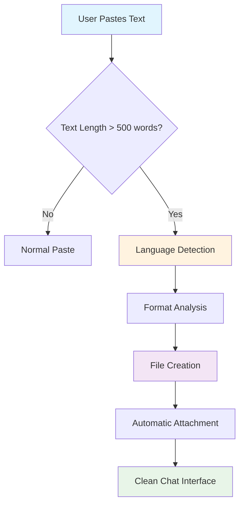

# Multi-AI File Paster

<div align="center">


**Free Chrome Extension for AI File Attachments**

*Turn large text content into clean file attachments across ChatGPT, Claude, Gemini, DeepSeek, and Grok - Completely Free*

<br>

[](#-installation)
[](https://github.com/JosephMatino/MultiAiFilePaster/releases/tag/v1.1.0)
[](https://github.com/JosephMatino/MultiAiFilePaster/blob/main/LICENSE)

[](#-supported-platforms)
[](#-file-format-support)
[](#-internationalization)
[](#-privacy--security)
[](#-installation)

---

Multi-AI File Paster is a free Chrome extension that automatically converts your pasted text content into file attachments on AI platforms. When you paste text over 500 words (customizable), it detects the content type and creates a properly formatted file attachment with the correct extension (.js, .py, .sql, etc.). This eliminates the need to manually create text files and upload them to ChatGPT, Claude, Gemini, DeepSeek, Grok, or other AI platforms.

### 🔄 Data Flow



Instead of the tedious process of copying code, creating a text file, saving it, then uploading to AI platforms, you just paste your text normally. The extension automatically detects when your pasted content is large enough to benefit from file formatting and converts it into a clean file attachment with proper syntax highlighting.

The extension works on Chrome, Edge, and Brave browsers. It recognizes over 20 file formats including Python, JavaScript, TypeScript, HTML, CSS, JSON, CSV, SQL, and Shell scripts. All processing happens on your device - no data is sent to external servers. The extension requires no configuration, no subscriptions, no hidden costs, and works immediately after installation.

</div>

---

## 🎬 See It In Action

### **How It Works**

<div align="center">

| **Without Extension** | **With Extension** |
|:---------------------:|:------------------:|
| Long code blocks break formatting | Clean file attachments |
| Hit character limits | No size restrictions |
| Messy conversations | Organized discussions |
| Manual file creation | Automatic detection |
| Copy-paste-save workflow | One-click attachment |

</div>

### **🎯 Real Use Cases**

Multi-AI File Paster excels in development workflows. During code reviews, developers can share complete modules as organized files instead of messy text blocks that break formatting. For bug reports, it automatically converts error logs and stack traces into readable files that maintain proper structure and syntax highlighting.

Data analysts can upload CSV datasets and format JSON responses, while technical writers can share API documentation, endpoint specifications, and schemas as properly structured files. Students and educators use Multi-AI File Paster to submit homework and coding projects as formatted files that preserve code integrity and readability.

---

## ✨ Key Features

Multi-AI File Paster offers native integration with five major AI platforms including ChatGPT, Claude, Gemini, DeepSeek, and Grok. The extension automatically identifies 20+ different file formats with high accuracy, ensuring your code and documents are properly formatted every time.

**Batch File Processing:** Automatically detects multiple code blocks in pasted text and creates separate files for each block. Perfect for multi-file projects where you paste content containing ```javascript, ```python, and ```css blocks - each becomes its own properly formatted file.

**Smart Language Detection:** Automatically detects programming languages and content types to select the most appropriate file extension. Supports 20+ languages including JavaScript, Python, SQL, CSS, HTML, and more.

**Analytics Dashboard:** View usage stats: total files, platform breakdowns, file type trends, time ranges (7/30/90 days, all‑time), and export data if you opt in.

Privacy and security are built into the core architecture. All processing happens locally on your device with zero external data transmission, meeting Chrome Manifest V3 compliance standards with minimal permissions. Multi-AI File Paster works immediately after installation with no configuration required, while offering customizable settings for word thresholds, delays, batch processing, smart language detection, and format overrides to match your workflow preferences.

---

## 💻 System Requirements

<div align="center">

| **Requirement** | **Specification** |
|:----------------:|:-----------------:|
| **Browser** | Chrome 88+ or any Chromium-based browser |
| **Operating System** | Windows, macOS, Linux |
| **Memory** | Minimal impact (~2MB RAM) |
| **Permissions** | Storage, ActiveTab, Alarms |
| **Internet** | Required for AI platform access |

</div>

---

## 📦 Installation

### **Method 1: Developer Installation (Current)**

1. **Clone the Repository**
   ```bash
   git clone https://github.com/JosephMatino/MultiAiFilePaster.git
   cd MultiAiFilePaster
   ```

2. **Install in Chrome**
   - Open Chrome and go to `chrome://extensions/`
   - Enable **Developer mode** (toggle in top-right)
   - Click **"Load unpacked"**
   - Select the `MultiAiFilePaster` folder
   - Extension will appear in your toolbar! 🎉

3. **Verify Installation**
   - Click the extension icon in your toolbar
   - You should see the settings popup
   - Visit any supported AI platform to test

### **🏪 Method 2: Chrome Web Store (Recommended)**
*One-click installation from Chrome Web Store - coming soon*

1. **Visit Chrome Web Store** (publishing in progress)
2. **Click "Add to Chrome"**
3. **Confirm installation** in popup dialog
4. **Extension ready!** - No setup required

---

## 🚀 Quick Start (2 Minutes)

### **Get Started in 2 Minutes**
1. **Install**: Load the extension using Developer Mode (see Installation section)
2. **Test**: Navigate to ChatGPT and paste this sample code:
   ```python
   def fibonacci(n):
       if n <= 1:
           return n
       return fibonacci(n-1) + fibonacci(n-2)

   # Calculate first 10 Fibonacci numbers
   for i in range(10):
       print(f"F({i}) = {fibonacci(i)}")
   ```
3. **Result**: The extension creates a clean `fibonacci.py` file attachment automatically
4. **Customize**: Access settings through the extension popup to adjust thresholds and preferences

Multi-AI File Paster now handles all your code and document pastes across supported AI platforms.

---

## 📖 How to Use

Multi-AI File Paster works automatically once installed. Navigate to any supported AI platform like ChatGPT, Claude, Gemini, DeepSeek, or Grok, then paste your long content. When you paste text containing 500 or more words, it automatically detects the content format and creates a clean file attachment, keeping your conversation organized with properly formatted files.

For shorter content or immediate file creation, use manual controls. Press `Ctrl/Cmd + Shift + S` to instantly attach your current text as a file, or click the "Attach typed text as file" button in the extension popup. This works perfectly for shorter code snippets or documents that you want formatted as files regardless of length.

Multi-AI File Paster offers flexible customization options to match your workflow. Adjust the word threshold anywhere from 50 to 15,000 words (default is 500 words). Enable the delay feature for 1-15 seconds with a cancel button if you want time to review before file creation. Choose between automatic format detection or manually select your preferred file type.

---

## 🤖 **Supported Platforms**

<div align="center">

| **Platform** | **Status** | **URLs** | **Notes** |
|:-------------:|:----------:|:--------:|:---------:|
| **ChatGPT** | ✅ Supported | `chat.openai.com`<br/>`chatgpt.com` | File input + drag‑drop |
| **Claude** | ✅ Supported | `claude.ai` | File input (override option available) |
| **Gemini** | ✅ Supported | `gemini.google.com` | File input + drag‑drop fallback |
| **DeepSeek** | ✅ Supported | `chat.deepseek.com` | File input only |
| **Grok** | ✅ Supported | `x.com/i/grok` | File input only |

*All platforms tested and fully compatible with v1.1.0*

</div>

---

## 📁 **File Format Support**

### **20+ Supported Formats with Smart Detection**

<details>
<summary><b>📄 Text & Documentation</b></summary>

- **`.txt`** - Plain text (safe fallback for unknown content)
- **`.md`** - Markdown documentation and README files

</details>

<details>
<summary><b>💻 Programming Languages</b></summary>

- **`.js`** - JavaScript code and Node.js scripts
- **`.ts`** - TypeScript applications and type definitions
- **`.py`** - Python scripts and applications
- **`.java`** - Java applications and large codebases
- **`.cs`** - C# .NET applications and services
- **`.cpp`** - C++ system programming and applications
- **`.c`** - C system programming and embedded code
- **`.rb`** - Ruby scripts and Rails applications
- **`.go`** - Go microservices and system tools
- **`.rs`** - Rust system programming and WebAssembly
- **`.php`** - PHP web development code
- **`.sh`** - Shell scripts and automation
- **`.html`** - HTML markup and web pages
- **`.css`** - Stylesheets and design code

</details>

<details>
<summary><b>💾 Data & Configuration</b></summary>

- **`.json`** - JSON data, configs, and API responses
- **`.xml`** - XML documents and configurations  
- **`.sql`** - Database queries and schemas
- **`.csv`** - Spreadsheet data and exports

</details>

<details>
<summary><b>🔧 Custom Extensions</b></summary>

- **Custom Format** - Specify any file extension for specialized file types
- **Auto-Detect** - Smart detection with .txt fallback for safety
- **Manual Override** - Force specific file types through settings or code fences

</details>

### **🧠 Smart Language Detection**

Multi-AI File Paster uses pattern recognition to identify file formats accurately:

**How Detection Works:**
- **Pattern Analysis**: Examines syntax patterns, keywords, and code structure
- **Confidence Scoring**: Only applies detected format when confidence exceeds 35% threshold
- **Smart Fallback**: Defaults to .txt for ambiguous content to prevent mislabeling
- **Manual Override**: Use markdown code fences (```python) or select format in settings
- **Context Awareness**: Distinguishes between similar formats (e.g., C vs C++, HTML vs Markdown)

---

## ⚡ Performance & Reliability

### **⚡ Performance**

Multi-AI File Paster delivers exceptional performance with instant language detection that completes in under 100 milliseconds. It maintains a minimal memory footprint, using less than 2MB of RAM while running. File creation works completely offline with no internet connection required - you only need internet access for the AI platforms themselves. Full cross-platform support across Windows, macOS, and Linux operating systems.

### **🆚 Why Use This Instead of Manual File Creation?**

<div align="center">

| **Manual Method** | **Multi-AI File Paster** |
|:-----------------:|:-------------------------:|
| ⏱️ 30+ seconds per file | ⚡ Instant (under 1 second) |
| 🤔 Guess the file format | 🧠 Smart auto-detection |
| 📝 Type filename manually | 🎯 Auto-generates meaningful names |
| 💾 Save to disk first | 🚀 Direct attachment |
| 🔄 Repeat for every paste | ⚙️ Set once, works forever |

</div>

---

## 🌍 Internationalization

Multi-AI File Paster supports 11 languages with complete native translations:

### **Supported Languages**

<div align="center">

| Language | Native | Status | Coverage |
|:--------:|:------:|:------:|:--------:|
| **English** | English | ✅ Complete | 648/648 keys |
| **العربية** | Arabic | ✅ Complete | 648/648 keys |
| **Kiswahili** | Swahili | ✅ Complete | 648/648 keys |
| **Español** | Spanish | ✅ Complete | 648/648 keys |
| **日本語** | Japanese | ✅ Complete | 648/648 keys |
| **Français** | French | ✅ Complete | 648/648 keys |
| **Русский** | Russian | ✅ Complete | 648/648 keys |
| **中文** | Chinese | ✅ Complete | 648/648 keys |
| **Português** | Portuguese | ✅ Complete | 648/648 keys |
| **Deutsch** | German | ✅ Complete | 648/648 keys |
| **हिंदी** | Hindi | ✅ Complete | 648/648 keys |

</div>

### **Language Features**
- **RTL Support**: Full right-to-left text support for Arabic
- **Context-Aware**: Different translations for different UI contexts
- **Chrome Standards**: Following Chrome extension i18n best practices
- **Auto-Detection**: Browser language automatically detected
- **Manual Selection**: Override language in extension settings
- **SHORT UI Text**: Layout-optimized translations prevent UI overflow
- **Real-time Sync**: Language changes sync instantly across all components

The extension automatically detects your browser language and displays the appropriate interface. All user-facing text, tooltips, error messages, and settings are fully translated with professional quality.

---

## 🔒 **Privacy & Security**

Multi-AI File Paster prioritizes your privacy and security with complete protection:

- **100% Local Processing**: All language analysis and file creation happens entirely on your device
- **Zero Data Transmission**: No data sent to external servers or third parties
- **Complete Privacy**: Your code and documents remain completely private
- **Chrome Manifest V3**: Built with latest Chrome security standards
- **Minimal Permissions**: Requests only essential permissions for core functionality

---

## 🔧 Troubleshooting

Multi-AI File Paster is designed to work reliably, but if you encounter issues, here are the most common solutions. If it isn't working, try refreshing the AI platform page and verify you're on a supported URL. When files aren't attaching automatically, check that your content meets the word count threshold (500+ words by default) and confirm the AI platform supports file uploads. If the wrong file format is detected, use manual format selection in settings or add code fences like ```python to your text. For settings that won't save, check your browser permissions and try disabling then re-enabling the extension.

---

## ❓ Common Questions

**"Wait, is this safe? I don't want my code sent to random servers."**

Your code never leaves your computer. This extension works exactly like manually creating a file and uploading it - no external servers, no data transmission. Everything happens locally in your browser.

**"I pasted my code but nothing happened. What's wrong?"**

Most likely your text is under 500 words (the default threshold). Check the extension popup - you can lower this to 50 words or disable it completely. Also make sure you're on a supported AI platform (ChatGPT, Claude, Gemini, DeepSeek, or Grok).

**"It created a .txt file instead of .py for my Python code. How do I fix this?"**

The extension analyzes your code patterns to detect the language. For better detection, either use code fences like ```python in your text, or manually set the file format in the extension settings.

**"Does this work on all AI platforms?"**

Currently supports ChatGPT (both chat.openai.com and chatgpt.com), Claude (claude.ai), Google Gemini, DeepSeek, and Grok. Each platform has slightly different file upload systems, so the extension adapts accordingly.

**"I'm worried about privacy. What data do you collect?"**

By default, nothing. There's an optional analytics feature (disabled by default) that only tracks basic usage like "file created" - no content, no personal data. You can see exactly what's collected in the extension popup.

**"Can I turn off the automatic file creation?"**

Yes! You can disable auto-detection and use the manual "Save as File" button, or use the keyboard shortcut Ctrl/Cmd+Shift+S. You can also add a delay with a cancel button.

**"Claude already has paste-to-file. Why do I need this?"**

Claude's feature is basic. This extension adds smart language detection, customizable word thresholds, batch processing, and works consistently across all AI platforms. You can also disable the extension on Claude if you prefer their native feature.

**"Does it support shell scripts and custom file extensions?"**

Yes! The extension supports .sh files and custom file extensions. You can choose from 20+ built-in formats or specify your own custom extension for specialized file types.

**"Why can't I see the analytics dashboard?"**

The analytics dashboard is only visible when anonymous usage analytics is enabled in settings. This ensures no data is processed unless you explicitly opt in. Enable it in the extension popup under Privacy settings to see your usage insights.

---

## 📞 Support & Development

<div align="center">

<table>
<tr>
<td align="center" width="50%">
<h4>Joseph Matino</h4>
<strong>CTO & Lead Developer</strong><br/>
<a href="https://josephmatino.com">🌐 Website</a> •
<a href="mailto:dev@josephmatino.com">📧 Email</a><br/>
<em>Technical architecture and implementation</em>
</td>
<td align="center" width="50%">
<h4>Majok Deng</h4>
<strong>CEO & Scrum Master</strong><br/>
<a href="https://majokdeng.com">🌐 Website</a> •
<a href="mailto:scrum@majokdeng.com">📧 Email</a><br/>
<em>Project management and coordination</em>
</td>
</tr>
</table>

### **Powered By**

<div align="center">
<a href="https://hostwek.com" target="_blank">

</a>
<br/>
<strong>WekTurbo Designs - Hostwek LTD</strong><br/>
<a href="https://hostwek.com">🏢 Company Website</a>
</div>

### **Getting Help**

- **Technical Issues**: [dev@josephmatino.com](mailto:dev@josephmatino.com)
- **Bug Reports**: [GitHub Issues](https://github.com/JosephMatino/MultiAiFilePaster/issues/new?assignees=JosephMatino%2CMajok-Deng&labels=bug%2Cneeds-triage&projects=&template=bug_report.md&title=%5BBUG%5D+Brief+description+of+the+issue)
- **Feature Requests**: [GitHub Issues](https://github.com/JosephMatino/MultiAiFilePaster/issues/new?assignees=JosephMatino%2CMajok-Deng&labels=enhancement%2Cneeds-triage&projects=&template=feature_request.md&title=%5BFEATURE%5D+Brief+description+of+the+feature)
- **General Support**: [wekturbo@hostwek.com](mailto:wekturbo@hostwek.com)

</div>

---

## 🛠️ **Contributing & Development**

<div align="center">

[](https://github.com/JosephMatino/MultiAiFilePaster/blob/main/CONTRIBUTING.md)

</div>

### **🛠️ Development Setup**
```bash
# Fork and clone the repository
git clone https://github.com/JosephMatino/MultiAiFilePaster.git
cd MultiAiFilePaster

# Git Workflow (using included git.sh tool)
./git.sh                              # Interactive menu
./git.sh 18                           # Check status
./git.sh 9 "Your commit message"      # Commit changes
./git.sh 11                           # Push to develop

# Load extension in Chrome Developer Mode
# 1. Open chrome://extensions/
# 2. Enable "Developer mode"
# 3. Click "Load unpacked" → Select project folder
# 4. Start developing! 🎉
```

### **🔧 Git Workflow Helper**
This project includes a `git.sh` tool for streamlined development:

```bash
# Interactive mode (shows beautiful menu)
./git.sh

# Programmatic mode (time-saving direct commands)
./git.sh 5 2                          # Switch to branch #2
./git.sh 6 "feature-name"              # Rename current branch
./git.sh 9 "Fix bug #123"              # Commit with message
./git.sh 14 "v1.1.0" "Release v1.1.0"  # Create release tag
```

**Features:**
- 🎨 Styled terminal output
- 🔄 21 git operations with clear LOCAL/REMOTE indicators
- ⚠️ Safety warnings for destructive operations
- 🚀 GitHub Actions integration
- 📊 Repository status display

**📖 Complete Guide**: See [CONTRIBUTING.md](https://github.com/JosephMatino/MultiAiFilePaster/blob/main/CONTRIBUTING.md) for detailed development setup, coding standards, testing procedures, and contribution guidelines.

**🤝 Community Standards**: All contributors must follow our [Community Standards](.github/CODE_OF_CONDUCT.md) for collaboration and project participation.

---

## 📄 **License & Legal**

<div align="center">

This project uses the Hostwek Custom License. Personal, non‑commercial use is permitted. Commercial use, redistribution, and derivative works require written authorization from Hostwek LTD. See the full license text in `LICENSE`.

</div>

---

## 🌟 **Show Your Support**

<div align="center">

[](https://github.com/JosephMatino/MultiAiFilePaster/watchers)
[](https://github.com/JosephMatino/MultiAiFilePaster/fork)

</div>

---

## 🎯 **Version History & Changelog**

<details>
<summary><b>📋 Recent Updates (Click to expand)</b></summary>

### **v1.1.0 (Current) - Latest Release**
- ✅ **Batch File Processing** - Automatically detects multiple code blocks and creates separate files
- ✅ **Smart Language Detection** - Automatic file extension selection based on content analysis
- ✅ **Smart Code Detection** - Recognizes both fenced (```language) and indented code blocks
- ✅ **Progress Indicators** - Real-time feedback during batch processing and file operations
- ✅ **Complete Internationalization** - 11 languages with 648 translation keys each

### **v1.1.0 - Manual Save & Error Handling**
- ✅ Fixed manual save error handling with specific, helpful error messages
- ✅ Improved empty text detection - shows "No text found in chat input" instead of generic errors
- ✅ Fixed word threshold logic - manual save now respects the Min Words setting instead of using separate threshold
- ✅ Added platform-specific error guidance (ChatGPT, Claude, Gemini instructions)
- ✅ Enhanced error recovery with better detection of connection and context issues
- ✅ Clear toast notifications with actionable user feedback

### **v1.0.9 - Foundation Release**
- ✅ Multi-platform AI support (ChatGPT, Claude, Gemini, DeepSeek, Grok)
- ✅ Smart language detection with 20+ file formats
- ✅ Configurable settings and user preferences
- ✅ Privacy-first on-device processing
- ✅ Basic file attachment functionality
- ✅ Chrome Extension Manifest V3 compliance

**📖 Complete History**: See [CHANGELOG.md](https://github.com/JosephMatino/MultiAiFilePaster/blob/main/changelog.md) for detailed version history.

</details>

---

<div align="center">

## Ready to Install

*Chrome extension that makes AI conversations cleaner and more organized*


---

### **🔗 Quick Action Links**

[⭐ **Star on GitHub**](https://github.com/JosephMatino/MultiAiFilePaster/stargazers) •
[🐛 **Report Bug**](https://github.com/JosephMatino/MultiAiFilePaster/issues/new?assignees=JosephMatino%2CMajok-Deng&labels=bug%2Cneeds-triage&projects=&template=bug_report.md&title=%5BBUG%5D+Brief+description+of+the+issue) •
[💡 **Request Feature**](https://github.com/JosephMatino/MultiAiFilePaster/issues/new?assignees=JosephMatino%2CMajok-Deng&labels=enhancement%2Cneeds-triage&projects=&template=feature_request.md&title=%5BFEATURE%5D+Brief+description+of+the+feature) •
[📧 **Get Support**](mailto:wekturbo@hostwek.com) •
[🤝 **Contribute**](https://github.com/JosephMatino/MultiAiFilePaster/blob/main/CONTRIBUTING.md)

---

**© 2025 · Multi‑AI File Paster · Developed by [Joseph Matino](https://josephmatino.com) | Scrum Master: [Majok Deng](https://majokdeng.com) | powered by <a href="https://hostwek.com" target="_blank" rel="noopener" aria-label="Hostwek website"></a>**

*Making AI conversations cleaner, one file at a time* 🚀

</div>
